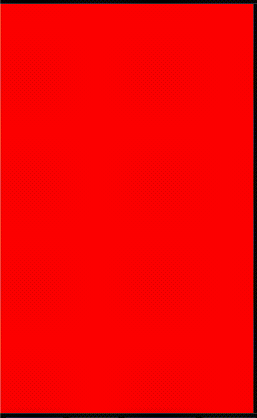

# JavaScript scrollIntoView

在业务开发中发现了一个陌生的方法：`scrollIntoView` 。从字面意思来看，这个方法应该是让 dom 元素滚动到视口，于是查阅了一下[MDN](https://developer.mozilla.org/en-US/docs/Web/API/Element/scrollIntoView)。发现 MDN 文档并没有详细描述某些参数的具体表现形式，也没有相关的效果示意图。于是自己动手详细记录 `scrollIntoView` 方法。

## 描述

Element 方法 `scrollIntoView`：滚动父级容器，使得元素出现在视口。

## 参数

```ts
type alignToTop = boolean;
type scrollIntoViewOptions = {
  behavior: 'auto' | 'smooth';
  block: 'start' | 'center' | 'end' | 'nearest';
  inline: 'start' | 'center' | 'end' | 'nearest';
};

interface Element {
  scrollIntoView(arg?: alignToTop | scrollIntoViewOptions): void;
}
```

scrollIntoViewOptions，一个包含下列属性的对象。

- `behavior`定义过渡动画，默认值为`auto`。

  - `auto`，表示没有平滑的滚动动画效果。
  - `smooth`，表示有平滑的滚动动画效果。

- `block`定义垂直方向的对齐，默认值为`start`。

  - `start`，表示`顶端`对齐。
  - `center`，表示`中间`对齐。
  - `end`，表示`底端`对齐。
  - `nearest`：
    - 如果元素完全在视口内，则垂直方向不发生滚动。
    - 如果元素未能完全在视口内，则根据最短滚动距离原则，垂直方向滚动父级容器，使元素完全在视口内。

- `inline`定义水平方向的对齐，默认值为`nearest`。
  - `start`，表示`左端`对齐。
  - `center`，表示`中间`对齐。
  - `end`，表示`右端`对齐。
  - `nearest`：
    - 如果元素完全在视口内，则水平方向不发生滚动。
    - 如果元素未能完全在视口内，则根据最短滚动距离原则，水平方向滚动父级容器，使元素完全在视口内。

alignToTop

- 当传入参数`true`时，相当于`{behavior: 'auto', block: 'start', inline: 'nearest'}`
- 当传入参数`false`时，相当于`{behavior: 'auto', block: 'end', inline: 'nearest'}`

> 当未传入参数时，默认值为：`{behavior: 'auto', block: 'start', inline: 'nearest'}`

## 实例

```js
document.querySelector('div').scrollIntoView({
  behavior: 'smooth',
  block: 'center',
  inline: 'nearest',
});
```

<p align="center"></p>

[动手试试看](https://codepen.io/chinatjc/pen/yLvoQBv)
