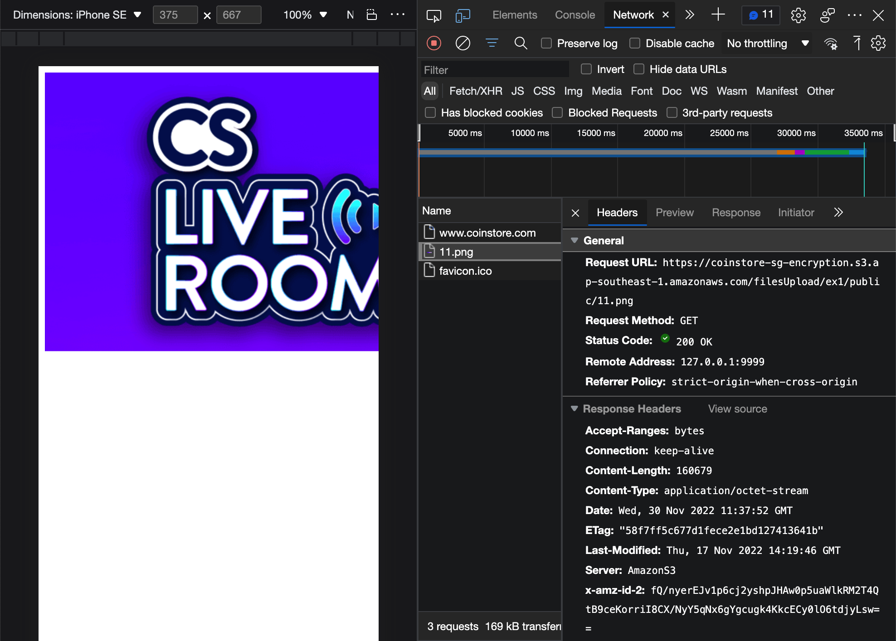
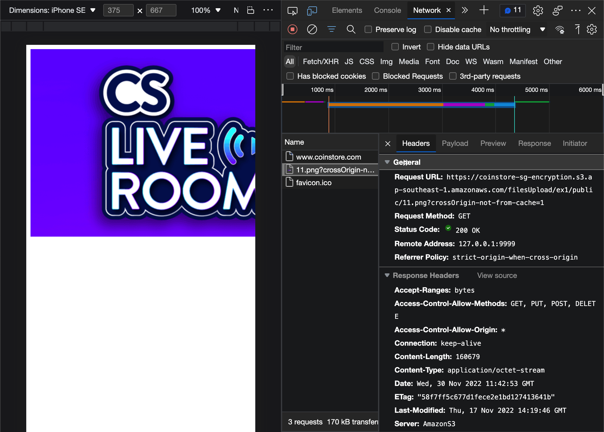
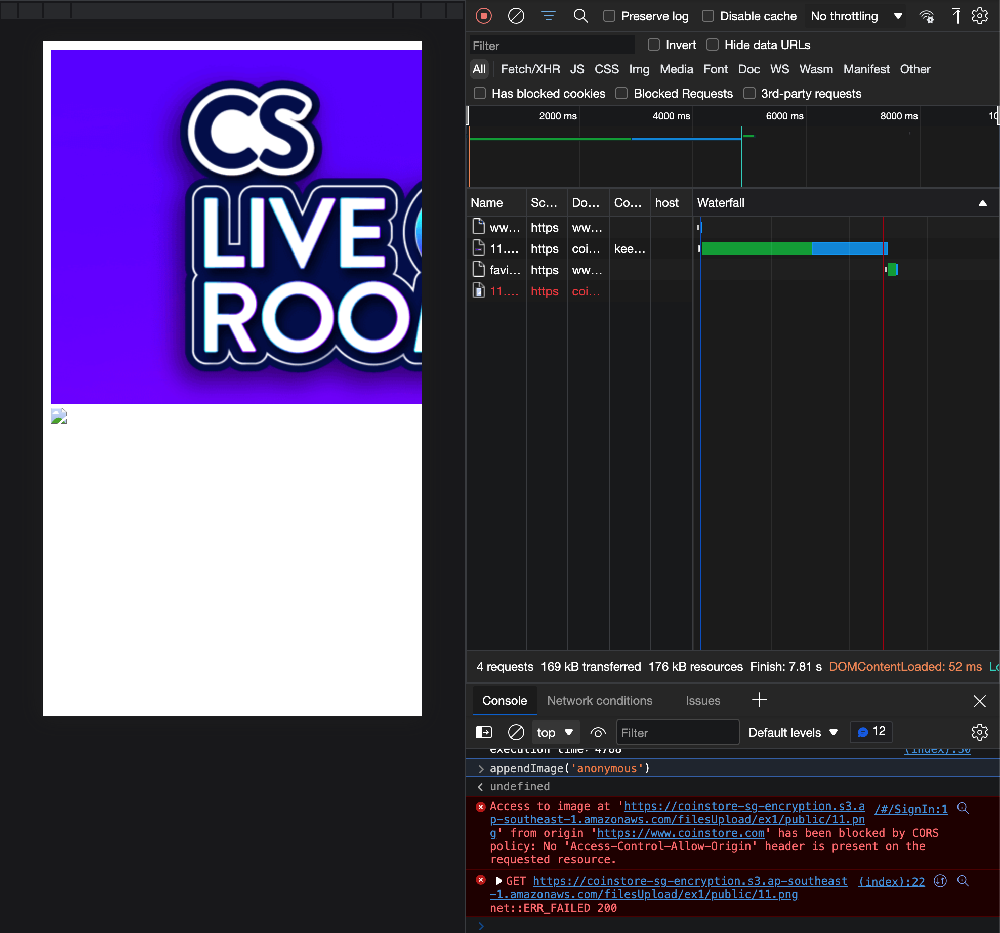
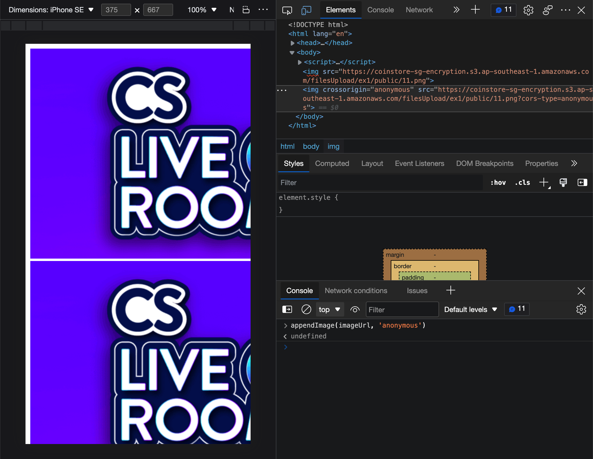

# 在Chrome浏览器中，即使\也会被同源策略拦截

在一次开发中，遇到了生成海报的需求：在图片相册界面用户选择若干张图片，在海报编辑界面用户通过拖动这些图片生成一张海报，供用户下载。

在图片相册界面，图片均展示正常且无报错发生。当用户选择若干张图片之后，进入海报编辑界面前，添加cors属性``重新加载这些图片，以便canvas处理这些图片数据（[图片添加cors属性原因](https://segmentfault.com/a/1190000040625661)）。神奇的是：所有的图片均无法显示，报错 `......has been blocked by CORS policy: No
Access-Control-Allow-Origin header is present on the
requested resource.`，原来被浏览器的同源策略拦截了。

这些图片存放在Amazon S3，都配置了允许跨域访问。添加了cors参数的img不应该被同源策略拦截，而无法显示。

## 抽象问题，并探究

添加图片的方法：

```js
const appendImage = (imageUrl, crossOrigin = 'anonymous') => {
  const image = document.createElement('img');

  if (crossOrigin) image.crossOrigin = crossOrigin;
  image.src = imageUrl;

  document.body.append(image);
};
```

当在Chrome浏览器中添加全新的图片时，显示正常：

<p align="center"></p>

清空浏览器缓存之后，当在浏览器中加载需要cors属性的图片时，显示正常：

<p align="center"></p>

清空浏览器缓存之后，当在浏览器中添加该图片时，显示正常；添加cors属性然后加载该图片时，无法显示：

<p align="center"></p>

通过Response Headers可以看到：因为没有响应`Access-Control-Allow-Origin`字段，被浏览器的CORS策略拦截了。

初步结论：通过以上三个现象可以得知，开发需求时的异常现象应该与Chrome浏览器的缓存有关。

## 原因

通过查询相关文档，发现早在2014年就有人给chromium提出[issue](https://bugs.chromium.org/p/chromium/issues/detail?id=409090)：图片资源（url）会缓存在浏览器中，下次访问相同的图片资源（url）时，返回被缓存资源的response。

结合上面的开发需求，可以得出原因：

1. 图片相册界面中的图片，均以未添加cors属性的方式请求，response返回无跨域头的数据，加载之后便被浏览器缓存；
2. 海报编辑界面中的图片，均以添加cors属性的方式请求，浏览器返回已有的缓存数据；
3. 由于缓存数据无跨域头，导致以添加cors属性的方式请求的图片资源，被浏览器的同源策略屏蔽掉。

然而Chromium的开发团队将该问题标记为`WontFix(Closed)`，可能是因为比较符合Chromium引擎的预期行为。

## 解决方案

在得知原因之后，便着手解决方案：为图片url的search部分添加一个字段，用来区分无cors属性的请求。

```js
const appendImage = (imageUrl, crossOrigin = 'anonymous') => {
  const image = document.createElement('img');
  let src = imageUrl;

  if (crossOrigin) {
    src = new URL(src);
    src.searchParams.append(`cors-type`, crossOrigin);
    src = src.toString();

    image.crossOrigin = crossOrigin;
  }

  image.src = src;

  document.body.append(image);
};
```

修改appendImage函数之后，再次请求图片，有无cors属性的图片均展示：

<p align="center"></p>

## 总结

Chrome浏览器的图片缓存，只按url来区分，因此有无cors属性的图片在请求时是无差别的。若缓存数据无响应`Access-Control-Allow-Origin`字段，而图片资源需要该字段时就会产生问题。

在url-search里添加字段，用以区分有无cors属性，使缓存能匹配期望的响应。
