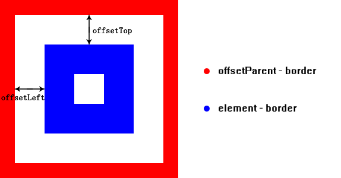
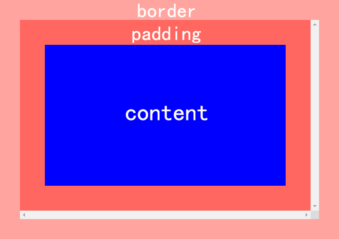
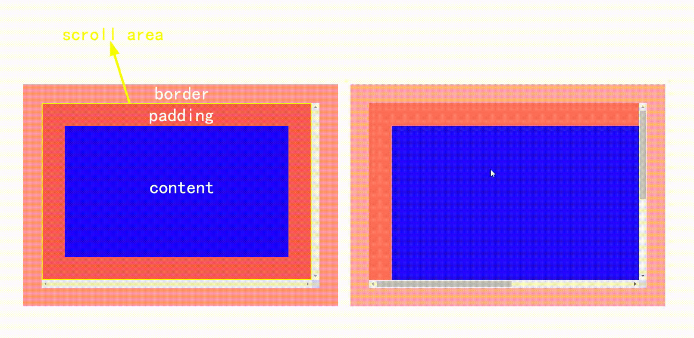
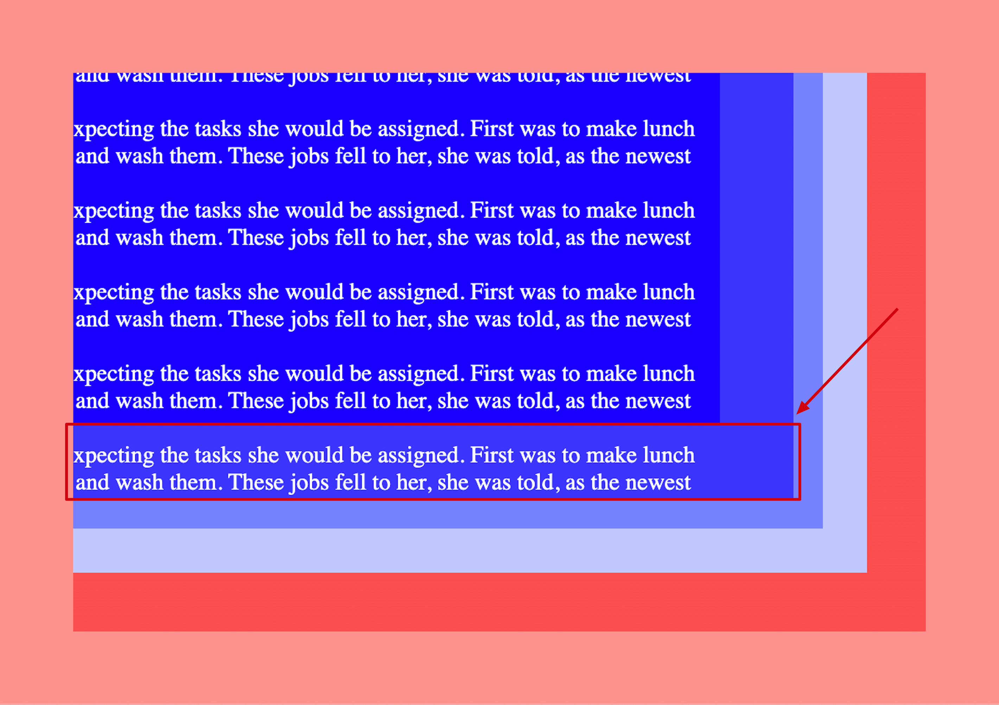
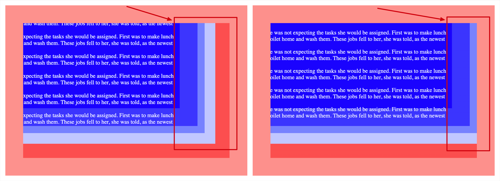
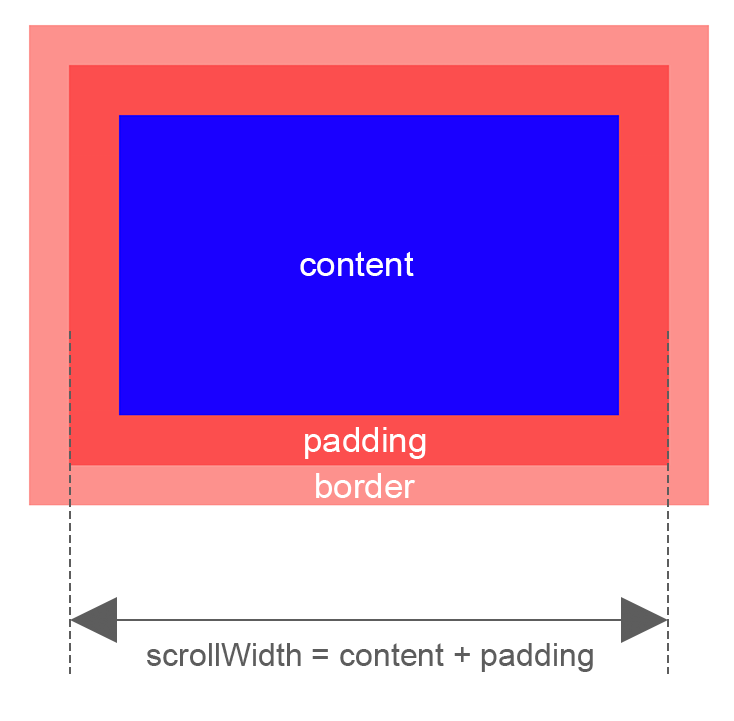
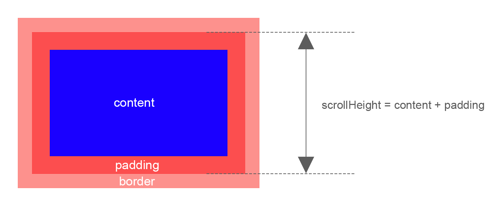
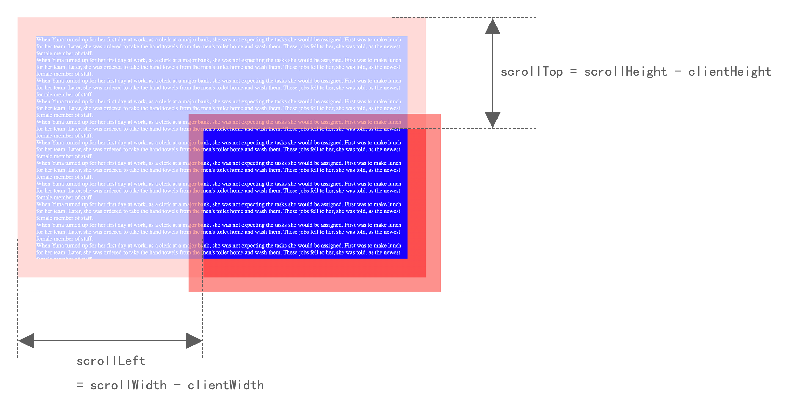
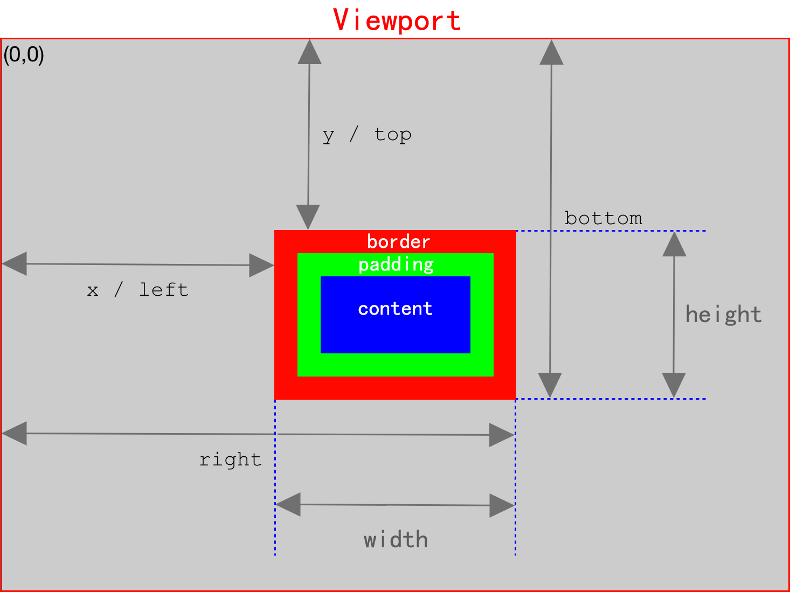

# 详细了解HTML元素的尺寸属性

获取元素的尺寸信息，有很多种方法。不同的尺寸属性有不同的定义，如果没有很好的总结，就很容易混淆。下面就一起来看看。

## 偏移尺寸（offset）

元素相对于偏移父元素（offsetParent）的偏移尺寸。

### offsetWidth

元素在水平方向上占用的像素尺寸，包括：`content`、`padding`、`vertical scrollbar（macos系统的滚动条不占据空间，因此不计算）`、`border`。

<p align="center"></p>

ℹ️ 返回值：**只读，不可设置；以像素为单位的整数；如果需要精确到小数，可以使用方法：`element.getBoundingClientRect()`。**

### offsetHeight

元素在垂直方向上占用的像素尺寸，包括：`content`、`padding`、`horizontal scrollbar（macos系统的滚动条不占据空间，因此不计算）`、`border`。

<p align="center"></p>

ℹ️ 返回值：**只读，不可设置；以像素为单位的整数；如果需要精确到小数，可以使用方法：`element.getBoundingClientRect()`。**

### offsetParent

`offsetLeft`和`offsetRight`属性的返回值，表示`元素`与`该元素的offsetParent`之间的偏移距离，因此确定offsetParent很重要。

元素的offsetParent确定步骤 —— 按照包含的层级关系，从近到远依次判断该元素的父元素：

1. 是否为定位（position不是static）元素；如果是，则返回该元素。
2. 是否为`<table>`、`<th>`、`<td>`元素；如果是，则返回该元素。
3. 是否为`<body>`元素；如果是，则返回该元素。

offsetParent为null的情况：

- 如果该元素或者其父元素的样式属性`display`设置为`none`。
- 如果该元素的样式属性`position`设置为`fixed`（Firefox返回`<body>`）。
- 该元素为`<body>`或`<html>`。

### offsetLeft

定义：元素左边框外侧距离该元素offsetParent左边框内侧的像素数。

<p align="center"></p>

ℹ️ 返回值：**只读，不可设置；以像素为单位的整数；如果需要精确到小数，可以使用方法：`element.getBoundingClientRect()`。**

### offsetTop

定义：元素上边框外侧距离该元素offsetParent上边框内侧的像素数。

<p align="center"></p>

ℹ️ 返回值：**只读，不可设置；以像素为单位的整数；如果需要精确到小数，可以使用方法：`element.getBoundingClientRect()`。**

## 客户端尺寸

### clientWidth

元素内部的宽度，包括：`content`、`padding`。

<p align="center"></p>

❗对于inline元素，clientWidth返回0。

ℹ️ 返回值：**只读，不可设置；以像素为单位的整数；如果需要精确到小数，可以使用方法：`element.getBoundingClientRect()`。**

### clientHeight

元素内部的高度，包括：`content`、`padding`。

<p align="center"></p>

❗对于inline元素，clientHeight返回0。

ℹ️ 返回值：**只读，不可设置；以像素为单位的整数；如果需要精确到小数，可以使用方法：`element.getBoundingClientRect()`。**

## 滚动尺寸

### 滚动产生的原理

当元素无法全部在容器元素中显示时，就会产生滚动条；通过水平或者垂直滚动条的滑动，把需要显示的内容展示到容器元素的视口。

对于Windows操作系统而言，滚动条是占据一定尺寸的；从里到外的尺寸属性：`content`、`padding`、`scroll`、`border`、`margin`。

<p align="center"></p>

当发生滚动时，`content` + `padding` 是滚动区域，`scroll` + `border` + `margin` 是固定区域。

<p align="center"></p>

> 通过上图可以看出：发生滚动的区域为`content` + `padding`。

### 滚动的兼容问题

通过下图，可以看出：当发生滚动时，content区域的文字可以溢出到padding区域。

<p align="center"></p>

通过下图，可以看出：在Safari浏览器中，元素的margin-right与容器元素的padding-right都未表现，与Chrome浏览器的表现不同。

<p align="center"></p>

通过上面两个例子，可以看出：元素的padding、容器元素的padding&margin，都有浏览器的兼容问题。

通过取消设置元素与容器元素的`padding`、`border`、`margin`，以`content`为滚动元素和容器元素：

```html
<style>
  .scroll {
    /* ...scroll style... */
  }

  .scroll-wrap {
    overflow: auto;
    width: 100%;
    height: 100%;
  }

  .scroll-inner {
    overflow: hidden;
    width: max-content;
    width: intrinsic; /* Safari/WebKit uses a non-standard name */
    width: -moz-max-content; /* Firefox/Gecko */
    width: -webkit-max-content; /* Chrome */
    width: max-content;
  }

  .scroll-content {
    /* ...content style... */
  }
</style>

<div class="scroll">
  <div class="scroll-wrap">
    <div class="scroll-inner">
      <div class="scroll-content"></div>
    </div>
  </div>
</div>
```

[通过demo可以看出，scroll的padding、border，scroll-content的padding、border、margin都没有相互影响](https://codepen.io/chinatjc/pen/qBKewZj)

### scrollWidth

容器元素在不使用水平滚动条时，可以全部展示内部元素的最小宽度，包括：`content`、`padding`。

<p align="center"></p>

ℹ️ 返回值：**只读，不可设置；以像素为单位的整数；如果需要精确到小数，可以使用方法：`element.getBoundingClientRect()`。**

### scrollHeight

容器元素在不使用垂直滚动条时，可以全部展示内部元素的最小高度，包括：`content`、`padding`。

<p align="center"></p>

ℹ️ 返回值：**只读，不可设置；以像素为单位的整数；如果需要精确到小数，可以使用方法：`element.getBoundingClientRect()`。**

### scrollTop

获取该属性时，返回：容器元素在垂直方向滚动的像素数。

设置该属性时：设定容器元素在垂直方向滚动的像素数。

❗垂直方向设置滚动像素数的范围：[0, scrollHeight - clientHeight]；

- 小于0时，`scrollTop`被设置为0。
- 大于`scrollHeight - clientHeight`时，`scrollTop`被设置为`scrollHeight - clientHeight`。

<p align="center"></p>

ℹ️ 返回值：**只读，不可设置；以像素为单位的整数；如果需要精确到小数，可以使用方法：`element.getBoundingClientRect()`。**

### scrollLeft

获取该属性时，返回：容器元素在水平方向滚动的像素数。

设置该属性时：设定容器元素在水平方向滚动的像素数。

❗水平方向设置滚动像素数的范围：[0, scrollWidth - clientWidth]；

- 小于0时，`scrollLeft`被设置为0。
- 大于`scrollWidth - clientWidth`时，`scrollTop`被设置为`scrollWidth - clientWidth`。

<p align="center"></p>

ℹ️ 返回值：**只读，不可设置；以像素为单位的整数；如果需要精确到小数，可以使用方法：`element.getBoundingClientRect()`。**

## 确定元素尺寸 -- getBoundingClientRect()方法

上面介绍的这些属性： `offsetWidth`、`offsetHeight`、`offsetLeft`、`offsetTop`、`clientWidth`、`clientHeight`、`scrollTop`、`scrollLeft`、`scrollWidth`、`scrollHeight`。返回值都是整数，与真实的数据相比，存在精度上的缺陷。

为此，浏览器在每个元素上提供了`getBoundingClientRect()`方法。

返回 DOMRect 对象，包含8个属性，每个属性值都可以是小数：

- width，其值等于 content + padding + borderWidth 的像素数
- height，其值等于 content + padding + borderWidth 的像素数
- x / left，元素左外侧距离**视口左内侧**的像素数
- y / top，元素上外侧距离**视口上内侧**的像素数
- right，元素右外侧距离**视口左内侧**的像素数
- bottom，元素下外侧距离**视口上内侧**的像素数

<p align="center"></p>

## 总结

元素的尺寸，平时使用的频率比较低。但用到时，面对众多的属性，确实容易让人混淆。通过上面简练的示意图，可以快速分辨各个属性的本质区别。希望对大家有帮助。

对于元素尺寸数据而言，建议使用`getBoundingClientRect()`方法，避免因整数的四舍五入而导致的精度问题。其他特定的需求，可以使用特定的属性。

❗所有这些尺寸属性都是只读的，每次访问都会重新计算。因此，应该尽量减少查询它们的次数。比如把查询的值保存在某个变量中，就可以避免影响性能。
