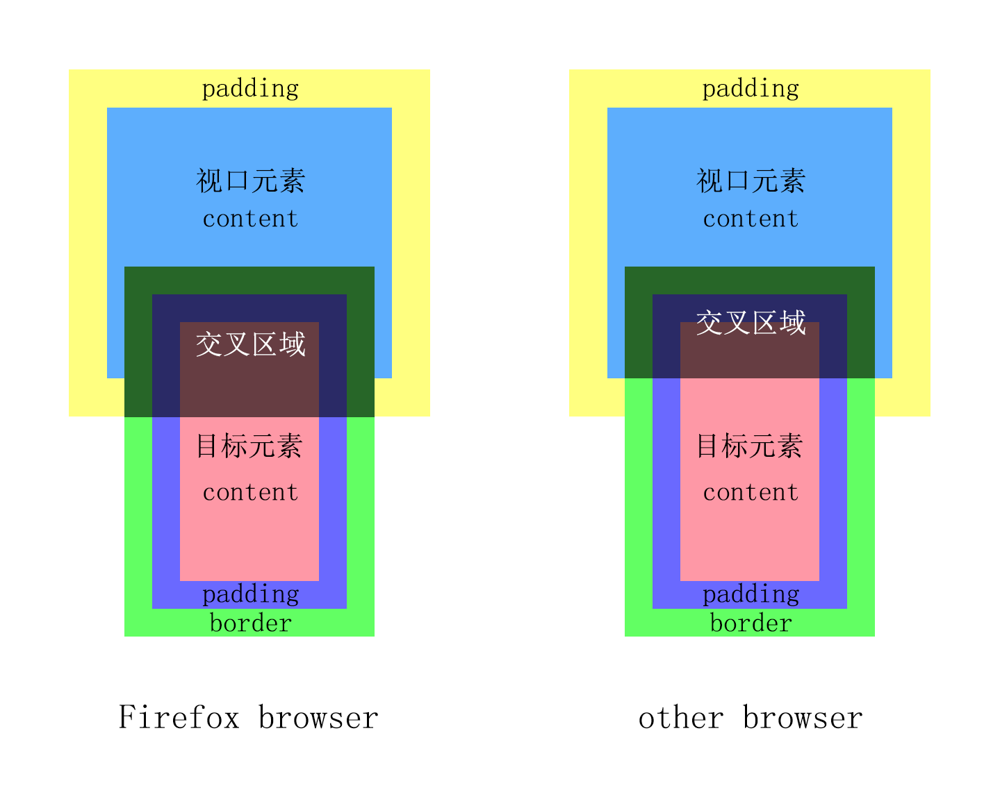

# 对 IntersectionObserver 深刻认识

之前开发广告位时，使用过API - IntersectionObserver监听广告位的曝光。当时，仅仅是通过实例demo快速了解然后使用，并没有深入了解。接下来就 IntersectionObserver API 深刻认识一下。

## 介绍

IntersectionObserver API提供了一种异步方法：观察目标元素与视口元素之间的交叉比例。

准确来说是：视口元素content、目标元素实际占用空间（content、padding、border），两者之间的交叉比例。

> 对于Firefox浏览器有区别：视口元素content+padding、目标元素实际占用空间（content、padding、border），两者之间的交叉比例。

<p align="center"></p>

## 使用

### 创建实例

```js
const observer = new IntersectionObserver(callback[, options])
```

通过执行IntersectionObserver构造函数，返回一个IntersectionObserver实例对象。

#### 参数 - options

用来配置IntersectionObserver实例的对象。如果未配置，则采用下列属性的默认值。

##### root: Element | null

设置交叉比例中的视口元素。

> 默认值为：浏览器的视口。

##### rootMargin: string

对视口元素边界的一组缩小或扩大的偏移量。通过偏移量改变视口的范围，从而改变交叉比例。

语法与`css-margin`类似：
- 偏移量的方位顺序 - `top right bottom left`，可以参考`css-margin`使用缩写。
- 偏移量只能以`px`或`%`为单位；如果以`%`为单位，则`top`和`bottom`以`height`为参照值，`left`和`right`以`width`为参照值。
- 偏移量为正数时，扩大视口区域；反转如果偏移量为负数，则缩小视口区域。

> 默认值为：0px 0px 0px 0px。既对视口元素的边界大小没有偏移。

##### threshold: number | number[]

设定交叉比例；当交叉比例达到设定值，将调用callback函数。

计算公式：交叉比例 = 交叉区域 / 目标元素（content + padding + border）

其数值区间：[0, 1]

当数值为0时，表示当交叉比例为0%。当数值为1时，表示当交叉比例为100%。

当threshold为数组时，表示设定一组交叉比例；当交叉比例达到任一设定值时，都会调用callback函数。

> 默认值为：0。既只要交叉比例大于0时，就调用callback函数。

#### 参数 - callback: (entries: IntersectionObserverEntry[], observer: IntersectionObserver) => void

调用callback函数的条件：
- 执行IntersectionObserver构造函数时。
- 交叉比例达到设定值（threshold）时。

该函数有如下参数：

##### entries - IntersectionObserverEntry[]

IntersectionObserver对象可以观察多个目标元素与视口元素之间的交叉比例。

因此，entries由描述目标元素与根元素交叉状态对象组成的数组。

IntersectionObserver对象包含以下属性：

###### boundingClientRect - DOMRectReadOnly

返回一个 DOMReactReadOnly 对象，该对象描述目标元素的边界信息。

###### intersectionRatio - number

目标元素与视口元素的交叉比例值。

###### intersectionRect - DOMRectReadOnly

返回一个 DOMReactReadOnly 对象，该对象描述目标元素和视口元素交叉区域的边界信息。

###### isIntersecting - boolean

判断目标元素与视口元素是否为交叉状态。

###### rootBounds - DOMRectReadOnly | null

视口元素的边界信息。

###### target - element

目标元素。

###### time - number

time = 调用callback函数的时间 - document文档创建的时间

时间单位为毫秒。

##### observer - IntersectionObserver

该observer为： 执行IntersectionObserver构造函数后，返回的IntersectionObserver实例对象。

### 实例方法

#### IntersectionObserver.observe(target: Element): void

将某个目标元素设置为观察元素，一个IntersetionObserver可以观察多个目标元素。

> 要求：
> 1. 目标元素在视口元素中是可见的（不能为display: none）。
> 2. 目标元素是视口元素的子元素。

#### IntersectionObserver.unobserve(target: Element): void

取消某个目标元素的观察。

> 如果目标元素不是被观察的元素，则该方法什么也不做。

#### IntersectionObserver.disconnect(): void

取消所有目标元素的观察。

## 总结

IntersectionObserver API在日常开发中，会比较常见：广告的曝光、懒加载、列表无限滚动等。希望这篇详细的API介绍，能够对大家日常开发有所帮助。
