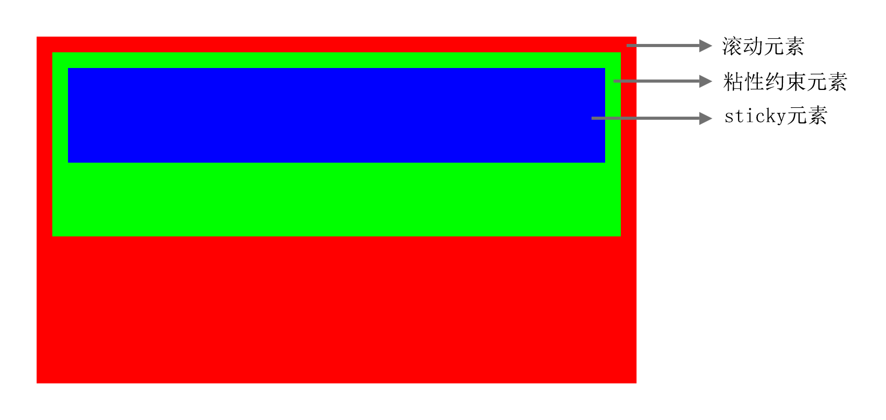
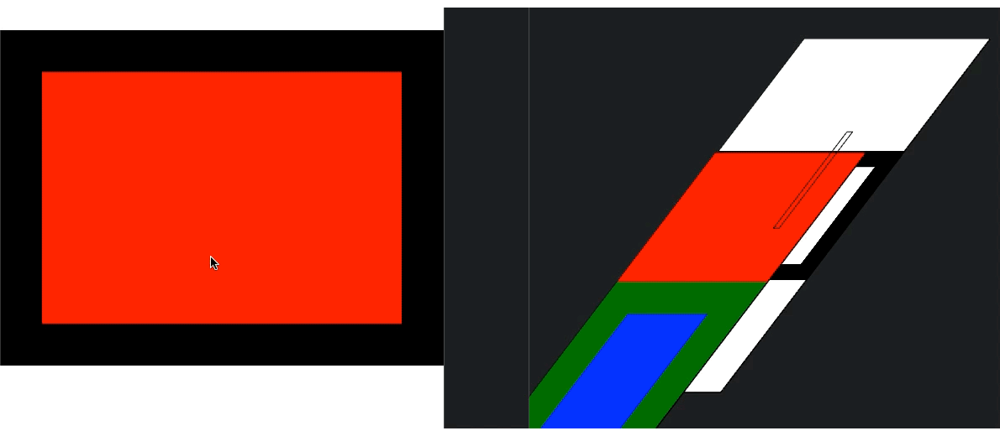

# 一个神奇的定位方式 - position: sticky

顶部导航往往需要固定在页面的顶部，不随滚动而发生相对视口位置的改变。

在没有使用sticky定位之前，往往采用fixed定位+placeholder占位的方式解决；需要借助javascript的能力，根据滚动距离，动态在fixed定位和static定位两者之间做切换；费时费力，还需要涉及大量的滚动计算。

在使用sticky定位之后，这一常见场景将仅靠一个定位属性即可完成，简单又实用。下面详细了解一下这个属性。

## 介绍

为了能直观地了解sticky定位，这里引入三个元素：滚动元素、粘性约束元素和sticky元素。

滚动元素：从dom层级关系来看，距离sticky元素最近的能滚动的父元素。

粘性约束元素：sticky元素的父元素。

sticky元素：
 - 设置了`position: sticky`的元素。
 - sticky定位，分为两个状态：相对定位、固定定位
 - 当sticky定位表现固定定位时，sticky元素相对于滚动元素定位。

## sticky定位原理

### 必须给sticky元素设置`top`、`right`、`bottom`、`left`中的任何一个值。

因为`sticky元素`需要相对`滚动元素定位`，定位需要位置参数；所以必须给sticky元素设置`top`、`right`、`bottom`、`left`中的任何一个值。

### sticky元素与滚动元素、粘性约束元素三者之间的UI表现

#### sticky元素的显示范围

`sticky元素`（content+padding+border+margin）只能在`粘性约束元素`的`content`范围内移动。

> 当为`sticky元素`设置偏移样式时，可以显示在`粘性约束元素`的content范围之外；但sticky定位的本质不会改变，只是sticky元素的显示位置发生了偏移。

#### 当sticky元素表现固定定位时，其定位逻辑

为`sticky元素`设置的定位距离，体现在：`sticky元素`的外边界（border or padding or content）到`滚动元素`的内边界（padding or content）之间的距离

#### sticky元素表现为固定定位的条件

1. `sticky元素`需要达到固定定位的位置。

2. 为`sticky元素`设置位置参数，相反方向上`sticky元素`的外边界（margin or border or padding or content）到`粘性约束元素`的内边界（content）之间需要有元素，可以撑起一定的空间，供`sticky元素`固定定位使用。
	- 例如：当sticky元素设置`top`之后；`sticky元素`的外边界（margin-bottom or border-bottom or padding-bottom or content-bottom）到`粘性约束元素`的content-bottom之间**有元素存在，且能撑起一定的空间**。

3. `粘性约束元素`与`滚动元素`之间不能存在样式属性为`overflow: hidden`的元素。

#### sticky元素的表现

1. sticky元素会创建一个新的层叠上下文；但在父元素中会留下占位符，不会影响任何其他元素的位置。

2. 同一个`粘性约束元素`的多个`sticky元素`，当表现为固定定位时，可能会重叠在一起；默认情况下，靠后的`sticky元素`层级比靠前的高，但可以通过`z-index`调整。

## 具体的例子

两个sticky元素依次不同高度吸顶

[动手试试看](https://codepen.io/chinatjc/pen/yLvoQBv?editors=1100)

## 总结

相对其他三种定位（相对定位、绝对定位、固定定位）而言，sticky定位处理的场景比较复杂，且涉及到的元素多。但掌握其原理之后，遇到`导航吸顶`、`底部按钮`等场景时，将十分简单、高效。
