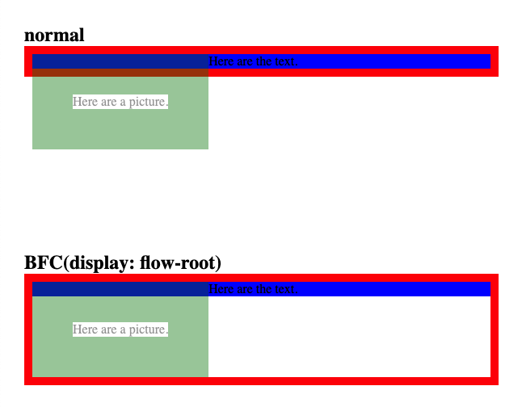
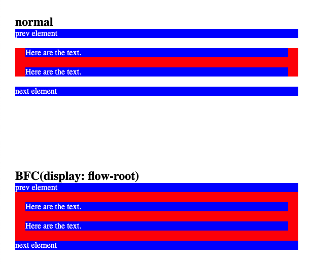

# 了解 BFC

对于页面的布局，前端开发者都大概了解：block元素占据网页一整行空间，从上到下排列；多个inline元素共享网页一整行空间，从左到右，超出横向空间时，则向下排列。但在开发页面时，会经常遇到浮动高度塌陷、垂直方向上的margin重叠or溢出等场景。虽然利用CSS Hack可以快速解决问题，但其背后的原理始终没去理解。有时候某个CSS Hack还有副作用，虽然解决了问题，但又新增了其他问题；为此还需要增加一些dom，导致代码比较冗余，不利于后续的开发者阅读代码。上面说的场景，其背后原理都和BFC有关，接下来就好好了解一下BFC。

## 什么是BFC

`BFC`（Block formatting contexts），块级格式化上下文。**它是独立的渲染区域，该区域内的子元素不会影响外部的元素。**

## BFC 布局特点

1. 默认情况下，`BFC`内的子元素（content+padding+border+margin）仅能在`BFC`的content区域内展示。
2. float元素也会决定`BFC`的高度，从而撑起`BFC`的高度。

## 如何创建BFC

1. 根元素(\<html>)

2. 浮动元素（元素的 float 不是 none）

3. 绝对定位元素（元素的 position 为 absolute 或 fixed）

4. 行内块元素（元素的 display 为 inline-block）

5. 表格单元格（元素的 display为 table-cell，HTML表格单元格默认为该值）

6. 表格标题（元素的 display 为 table-caption，HTML表格标题默认为该值）

7. 匿名表格单元格元素（元素的 display为 table、table-row、 table-row-group、table-header-group、table-footer-group（分别是HTML table、row、tbody、thead、tfoot的默认属性）或 inline-table）

8. overflow 值不为 visible 和 clip 的块元素

9. display 值为 flow-root 的元素，可以创建无副作用的BFC

10. 弹性元素（display为 flex 或 inline-flex元素的直接子元素）

11. 网格元素（display为 grid 或 inline-grid 元素的直接子元素）

> 除`display: flow-root`方法之外，其他方法或多或少有副作用。因此除非有特殊场景需要，否则建议使用`display: flow-root`创建BFC。

## BFC的实际应用

### 清除浮动

有了flex布局之后，float布局就很少使用了。但在某些文字布局场景下，float布局还是有一席之位的。在float布局流行的时代，都需要处理高度塌陷的问题。接下来，我们用`display: flow-root`来处理高度塌陷的问题。

[动手试试看](https://codepen.io/chinatjc/pen/poZWGrZ?editors=1100)

### 阻止子元素的垂直方向margin塌陷

默认情况下，垂直方向上，子元素的margin会与父元素（no padding & border）的margin合并，或者子元素的margin显示在父元素之外。但这并不是我们期望的，我们期望子元素的margin显示在父元素的content范围内。接下来，我们用`display: flow-root`来处理这个问题。

[动手试试看](https://codepen.io/chinatjc/pen/ZEjXZyJ)

## 总结

BFC是页面上一个隔离的布局容器，容器里的子元素不会影响到容器外的元素。利用BFC，可以很好地解决日常开发中的布局问题。
