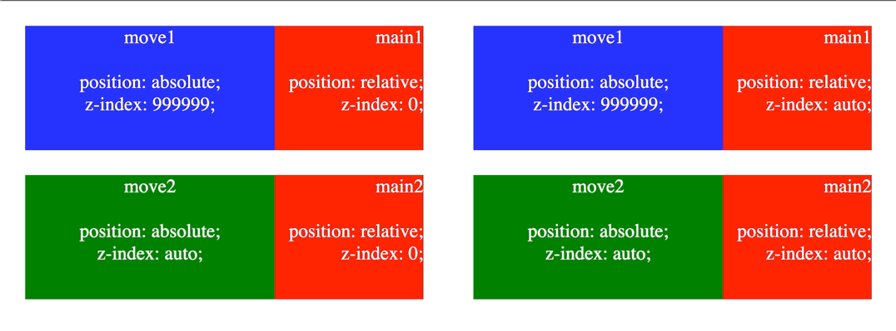
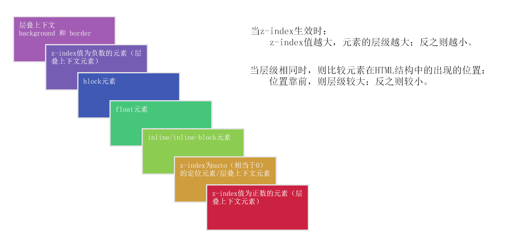
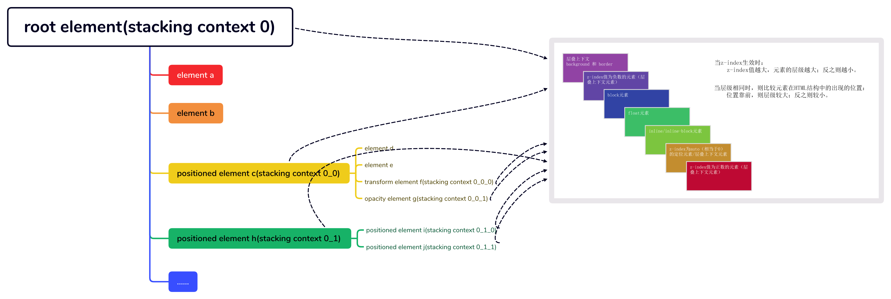

# 由z-index属性，引发对层叠上下文的全面认知

在日常开发中，经常使用`z-index`样式属性调整元素的层级大小。一般情况下，都能达到元素之间覆盖效果的要求。但在某些场景下，不论定位元素`z-index`属性值设置多大，都无法在页面的最顶层呈现。虽然可以可以把该元素提升为\<body>的直接子元素，并且确实可以达到效果，但比较繁琐，开发效率比较低下。为此，开始对`z-index`样式属性开始研究，但研究到最后发现：页面的渲染是由若干个图层通过层叠上下文的顺序，依次渲染而成。下面就层叠上下文全面说说。

## 层叠上下文（stacking context）

层叠上下文是HTML中的一个三维概念，是元素在z轴上的相对位置的描述。对于曾经通过photoshop设计稿来获取页面元素尺寸的开发者而言，层叠上下文和图层的概念非常类似。

### 元素形成层叠上下文的条件

1. 文档根元素（\<html>）；

2. position 值为 absolute（绝对定位）或 relative（相对定位）且 z-index 值不为 auto 的元素；

3. position 值为 fixed（固定定位）或 sticky（粘滞定位）的元素（沾滞定位适配所有移动设备上的浏览器，但老的桌面浏览器不支持）；

4. flex (flex) 容器的子元素，且 z-index 值不为 auto；

5. grid (grid) 容器的子元素，且 z-index 值不为 auto；

6. opacity 属性值小于 1 的元素（参见 the specification for opacity）；

7. mix-blend-mode 属性值不为 normal 的元素；

8. 以下任意属性值不为 none 的元素：
   transform、
   filter、
   backdrop-filter、
   perspective、
   clip-path、
   mask / mask-image / mask-border

9. isolation 属性值为 isolate 的元素；

10. will-change 值设定了任一属性而该属性在 non-initial 值时会创建层叠上下文的元素；

11. contain 属性值为 layout、paint 或包含它们其中之一的合成值（比如 contain: strict、contain: content）的元素。

### 层叠上下文之间的关系

层叠上下文的子元素在满足条件后可以形成一个新的子层叠上下文，从而整体上形成层叠上下文的树形关系（父子嵌套、兄弟平行）。

不同层叠上下文的各个子元素，其影响范围仅限于父级层叠上下文，而不会影响到其他层叠上下文。例如：

上图中：

- 左侧中的main1和main2设置了`z-index`为0，形成了新的层叠上下文，并且main2的层级比main1大；move1设置了`z-index`为999999，但由于无法突破父级层叠上下文的限制，无法覆盖在move2的上面。
- 右侧中的main1和main2设置了`z-index`为auto，无法形成了新的层叠上下文；move1和move2有共同的父级层叠上下文，由于move1设置了`z-index`为999999，所以可以覆盖在move2的上面。

[试试看](https://codepen.io/chinatjc/pen/xxJWMRP)

## 层叠顺序（stacking order）

一个层叠上下文的子元素可以是层叠上下文，也可以不是层叠上下文。子元素在z轴上的顺序规则，是通过层叠顺序来表达的。具体如下图所示：

## 整体示意图

## 总结

由`z-index`引发了对层叠上下文的全面认知。现在利用层叠上下文的逻辑，解释开头的现象：因为设置`z-index`属性的定位元素，其父元素为层叠上下文（也为定位元素），并且父元素并非位于整个页面的最高层级；所以设置`z-index`属性的定位元素，无论其`z-index`属性值设置多大，都无法突破父元素的限制，达到整个页面的最高层级。

在日常开发中，有很多开发者在面对元素层叠场景时，都会为每个相关元素添加`z-index`属性。希望这篇文章能对这种行为有所帮助，全面认知层叠上下文，减少非必要`z-index`属性的书写。
