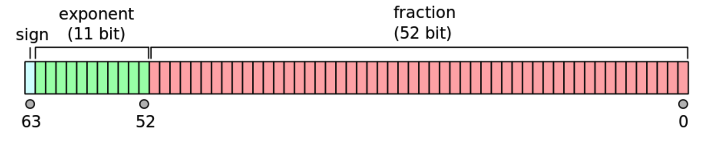

# 由 0.1 和 0.2 引发对Number类型的深入了解

对于JavaScript语言而言，在引入`BigInt`之前，所有的数字都用`Number`类型表示。

根据[ECMA-262规范对`Number`类型](https://tc39.es/ecma262/multipage/overview.html#sec-terms-and-definitions-number-value)的定义：采用IEEE754标准，用64位空间和浮点数算法在内存中存储数字。

## 64位双精度浮点数，存储结构以及表达值

双精度浮点数的64位存储空间，由符号位（sign）、指数（exponent）、小数（fraction）三部分组成：

<p align="center" style="background-color: #fff"></p>

| 组成     | 描述                         | 位数 |
| -------- | ---------------------------- | ---- |
| sign     | 符号（0表示正数、1表示负数） | 1    |
| exponent | 指数部分                     | 11   |
| fraction | 小数部分                     | 52   |

### 表达值类型的划分

64位双精度浮点数，具有11位指数，其存值范围为：00000000000 ~ 11111111111。根据指数的存值情况，将64位双精度浮点数的表达值分为三种类型。

### 1. 当指数全为1（11111111111）时，表示特殊值

- 当52位小数部分，都为0时：符号位是0，则表示`+Infinity`；符号位是1，则表示`-Infinity`。

- 当52位小数部分，不全都为0时，表示`NaN`（Not a Number）。

### 2. 当指数是由0和1组成时，表示规约形式的浮点数

其表达值的计算公式为： $\rm(-1)^s\times(1.\underbrace{bbb...b}_{f(52位)})_2\times2^{e-1023}$

s：sign表达的值（0或1），可以决定表达值的正负号。

f：fraction小数位，共52位二进制小数位。

e：exponent存值范围为1 ~ 2046（00000000001 ~ 11111111110）；因为需要表达尽可能精确的小数，所以exponent需要能表达负数；因此每个exponent的值需要固定地减去**偏移常量量（1023）**，得到一个正负均等分布的指数表达值范围-1022 ~ 1023。

> 偏移常量量计算公式： $2^{n-1}-1$。n为位数，这里是指数总位数11。

#### 表达值范围

1. sign为0，能使符号为正号；fraction小数位都是1，能使实数最大；exponent最大，能使幂最大；这三部分带入计算，得到`最大正数`：

$$\rm(-1)^0\times(1.\underbrace{111...1}_{52})_2\times2^{2046-1023} = (1.\underbrace{111...1}_{52})_2\times2^{1023} = 1.7976931348623157e+308$$

2. 与`最大正数`相比，符号改为`负号`，得到`最小负数`：

$$\rm(-1)^1\times(1.\underbrace{111...1}_{52})_2\times2^{2046-1023} = -(1.\underbrace{111...1}_{52})_2\times2^{1023} = -1.7976931348623157e+308$$

3. sign为1，能使符号为正号；fraction小数位都是0，能使实数最小；exponent最小，能使幂最小；这三部分带入计算，得到`最小正数`：

$$\rm(-1)^0\times(1.\underbrace{000...0}_{52})_2\times2^{1-1023} = (1)_2\times2^{-1022} = 2^{-1022} = 2.2250738585072014e-308$$

4. 与`最小正数`相比，符号改为`负号`，得到`最大负数`：

$$\rm(-1)^1\times(1.\underbrace{000...0}_{52})_2\times2^{1-1023} = -(1)_2\times2^{-1022} = -2^{-1022} = -2.2250738585072014e-308$$

5. fraction小数位为52位，而exponent指数表达值范围-1022 ~ 1023；因此完全可以通过乘以幂，让实数部分变为整数，得到`安全整数`（精度无丢失），其值范围：

$$\rm[ (-1)^0\times(1.\underbrace{000...0}_{52})_2\times2^{1023-1023}, (-1)^0\times(1.\underbrace{111...1}_{52})_2\times2^{1075-1023} ]$$

$$\rm[ (1)_2\times2^0, (1.\underbrace{111...1}_{52})_2\times2^{52} ]$$

$$\rm[ 1\times1, (1\underbrace{111...1}_{52})_2\times2^0 ]$$

$$\rm[ 1, (\underbrace{111...1}_{53})_2\times1 ]$$

$$\rm[ 1, (\underbrace{111...1}_{53})_2 ]$$

$$[ 1, 9007199254740991 ]$$

> 加上符号之后 [-9007199254740991, -1] U [1, 9007199254740991]

### 3. 当指数全为0（00000000000）时，表示非规约形式的浮点数

由`规约形式浮点数`的表达值范围可以看出，其接近0的值为： $-2^{-1022}$， $2^{-1022}$。

由此可以看出，实数的整数部分为1，幂只能无限接近0，但却无法表达0。

为了解决0值的问题，IEEE754对指数全为0（00000000000）的情况，确定了另一种计算公式： $\rm(-1)^s\times(0.\underbrace{bbb...b}_{f(52位)})_2\times2^{e-1022}$（e = 0）

s：sign表达的值（0或1），可以决定表达值的正负号。

f：fraction小数位，共52位二进制小数位。

e：exponent的值为0，其表达值为-1022（0-1022）。

> IEEE754标准规定：非规约形式的浮点数指数的偏移值比规约形式的浮点数的指数偏移值小1。所以该公式的指数偏移量为1022，而非1023。

#### 表达值范围

1. sign为0，能使符号为正号；fraction小数位都是1，能使实数最大；带入计算，得到`最大正数`：

$$\rm(-1)^0\times(0.\underbrace{111...1}_{52})_2\times2^{0-1022} = (0.\underbrace{111...1}_{52})_2\times2^{-1022} = 2.225073858507201e-308$$

2. 与`最大正数`相比，符号改为`负号`，得到`最小负数`：

$$\rm(-1)^1\times(0.\underbrace{111...1}_{52})_2\times2^{0-1022} = -(0.\underbrace{111...1}_{52})_2\times2^{-1022} = -2.225073858507201e-308$$

3. sign为0，能使符号为正号；fraction小数位的最后一位是1，能使实数为最小正数；带入计算，得到`最小正数`：

$$\rm(-1)^0\times(0.\underbrace{000...1}_{52})_2\times2^{0-1022} = (0.\underbrace{000...1}_{52})_2\times2^{-1022} = 1_2\times2^{-1074} = 2^{-1074} = 5e-324$$

4. sign为1，能使符号为负号；fraction小数位的最后一位是1，能使实数为最小正数；带入计算，得到`最大负数`：

$$\rm(-1)^1\times(0.\underbrace{000...1}_{52})_2\times2^{0-1022} = -(0.\underbrace{000...1}_{52})_2\times2^{-1022} = -1_2\times2^{-1074} = -2^{-1074} = -5e-324$$

5. sign为0，能使符号为正号；fraction小数位都是0，能使实数为0；带入计算，得到`0`：

$$\rm(-1)^0\times(0.\underbrace{000...0}_{52})_2\times2^{0-1022} = 0\times2^{-1022} = 0$$

6. sign为1，能使符号为负号；fraction小数位都是0，能使实数为0；带入计算，得到`-0`：

$$\rm(-1)^1\times(0.\underbrace{000...0}_{52})_2\times2^{0-1022} = -0\times2^{-1022} = -0$$

## 64位浮点数的舍入方式

64位浮点数，用于存储小数的空间只有52位，不可能存储无限多的小数，必然存在舍入的情况。根据IEEE754标准对舍入方式的定义：

> \- roundTiesToEven, the floating-point number nearest to the infinitely precise result shall be delivered; if the two nearest floating-point numbers bracketing an unrepresentable infinitely precise result are equally near, the one with an even least significant digit shall be delivered

> The roundTiesToEven rounding-direction attribute shall be the default rounding-direction attribute for results in binary formats.

`roundTiesToEven`是64位浮点数的默认舍入方式，具体内容为：

1. 舍入结果应该是最接近无限精度真实值的浮点数；
2. 舍去的数字大于0.5，则最低位进1；舍去的数字小于0.5，则无需进位。
3. 舍去的数字等于0.5，且最低位是奇数的，则最低位进1；其他情况，则无需进位。

### 举例

- 对于1.001(1001)，舍入处理后为1.010（去掉多余的4位，加0.001）
- 对于1.001(0111)，舍入处理后为1.001（去掉多余的4位）
- 对于-1.001(1000)，舍入处理后为-1.010（去掉多余的4位，加0.001，因为此时最低位为1）
- 对于-1.010(1000)，舍入处理后为-1.010（直接去掉多余的4位，因为此时最低位为0）

### 含义

有限位数的64位浮点数，其背后代表的是一个无限精度真实值的区间，这个区间的任何值都可以通过默认的舍入方法，得到该有限位数的64位浮点数。

> 例如：对于1.001，其真实值区间为：
>
> $$[ (1.000(1\underbrace{0}_{n}1))_2, (1.001(0\underbrace{1}_{n}))_2 ]$$

## 64位浮点数转换为十进制数

根据IEEE754标准，对64位浮点数和十进制数转换行为的定义：

> Implementations shall provide conversions between each supported binary format and external decimal character sequences such that, under roundTiesToEven, conversion from the supported format to external decimal character sequence and back recovers the original floating-point representation, except that a signaling NaN might be converted to a quiet NaN. See 5.12.1 and 5.12.2 for details.

64位浮点数转换为十进制数；相反，该十进制数必须转换回原来的64位浮点数。

### chromium源码中，关于64位浮点数转换为十进制数的细节

在JavaScript中，十进制数的本质是一个十进制数的字符串。因此一个Number类型的数据转换为十进制数，调用的是`Number.prototype.toString`方法。

```c++
// v8/src/numbers/conversions.cc
const char* DoubleToCString(double v, base::Vector<char> buffer) {
// ...
      base::DoubleToAscii(
          v, base::DTOA_SHORTEST, 0,
          base::Vector<char>(decimal_rep, kV8DtoaBufferCapacity), &sign,
          &length, &decimal_point);
// ...
}

// v8/src/base/numbers/dtoa.h
enum DtoaMode {
  // Return the shortest correct representation.
  // For example the output of 0.299999999999999988897 is (the less accurate but
  // correct) 0.3.
  DTOA_SHORTEST,
};
```

通过上面的源码可知：64位浮点数转换为十进制数，使用的是`DTOA_SHORTEST`方法；该方法返回最短且正确的十进制数。

> 例如：
>
> 十进制数0.3
>
> 其二进制数为 $(1.\underbrace{0011}_{n})_2\times2^{-2}$
>
> 通过舍入方法，64位浮点数为 $(1.\underbrace{0011}_{52})_2\times2^{-2}$
>
> 64位浮点数真实值区间为：
>
> $$\rm[ (1.(\underbrace{0011}_{51})0010(1\underbrace{0}_{n}1))_2\times2^{-2}, (1.\underbrace{0011}_{52}(0\underbrace{1}_{n}))_2\times2^{-2} ] <=> [0.29999999999999996114, 0.30000000000000001665]$$
>
> 因此，数字0.3转换为十进制的字符串，取区间的最短字符串0.3。

```c++
  // v8/src/base/numbers/dtoa.h

  // The maximal number of digits that are needed to emit a double in base 10.
  // A higher precision can be achieved by using more digits, but the shortest
  // accurate representation of any double will never use more digits than
  // kBase10MaximalLength.
  // Note that DoubleToAscii null-terminates its input. So the given buffer
  // should be at least kBase10MaximalLength + 1 characters long.
  static const int kBase10MaximalLength = 17;
```

通过上面的源码可知：64位浮点数转换为十进制数，最多保留17位有效数字。

因此，0.1 + 0.2 = 0.30000000000000004，保留17位有效数字。

## 0.1 + 0.2 = 0.30000000000000004 背后的运算步骤

1. 十进制转换为二进制

   0.1 => $(1.\underbrace{1001}_{n})_2\times2^{-4}$

   0.2 => $(1.\underbrace{1001}_{n})_2\times2^{-3}$

2. 二进制转换为64位浮点数

   0.1 => $(1.\underbrace{1001}_{12}1010)_2\times2^{-4}$

   0.2 => $(1.\underbrace{1001}_{12}1010)_2\times2^{-3}$

3. 运算

   0.1 + 0.2 两个64位浮点数运算如下：

   $\qquad(0.1100\quad1100\quad1100\quad1100\quad1100\quad1100\quad1100\quad1100\quad1100\quad1100\quad1100\quad1100\quad1101\quad0)_2\times2^{-3}$

   $+\quad(1.1001\quad1001\quad1001\quad1001\quad1001\quad1001\quad1001\quad1001\quad1001\quad1001\quad1001\quad1001\quad1010)_2\times2^{-3}$

   $=(10.0110\quad0110\quad0110\quad0110\quad0110\quad0110\quad0110\quad0110\quad0110\quad0110\quad0110\quad0110\quad0111\quad0)_2\times2^{-3}$

   $=\quad(1.0011\quad0011\quad0011\quad0011\quad0011\quad0011\quad0011\quad0011\quad0011\quad0011\quad0011\quad0011\quad0011\quad10)_2\times2^{-2}$

   由于计算值的小数部分超出了64位浮点数小数部分的最大存储能力，所以采用默认的`roundTiesToEven`方法，对计算值进行舍入：超出部分为`10`，最后四位为`0011`，最低位是`1`；最低位进`1`，计算后得到最后四位为`0100`。

   存储到64位浮点数的值为： $(1.\underbrace{0011}_{12}0100)_2\times2^{-2}$

4. 64位浮点数转换为十进制数

   0.1 + 0.2 计算值为： $(1.\underbrace{0011}_{12}0100)_2\times2^{-2}$； 计算值的十进制数取17位有效数：0.30000000000000004。

   计算值对应的无限精度真实值范围

   最小值： $(1.\underbrace{0011}_{13}1)_2\times2^{-2}$

   最大值： $(1.\underbrace{0011}_{12}0100(1))_2\times2^{-2}$

   转换为十进制取17位有效数：[0.30000000000000002, 0.30000000000000007]。

   因为在[0.30000000000000002, 0.30000000000000007]中，没有比0.30000000000000004更短的十进制数了；所以0.1 + 0.2 计算值的十进制数为：0.30000000000000004

## 总结

在JavaScript语言中，`Number`类型的背后是IEEE754所定义的64位二进制浮点数。

其表达值范围为：[-1.7976931348623157e+308, -5e-324] U 0 U [5e-324, 1.7976931348623157e+308]

> 超过1.7976931348623157e+308为`Infinity`，小于-1.7976931348623157e+308为`-Infinity`，在[-5e-324, 5e-324]集合内的数字显示为0。

安全整数（无精度丢失的情况发生）的表达值范围：[-9007199254740991, 9007199254740991]；`在安全整数的范围内，表达数字、计算数字，不会存在精度丢失的现象，安全可靠`。

由于64位浮点数，使用二进制表达数字、计算数字；但开发者用JavaScript语言开发业务时，通常使用十进制表达数字。在`安全整数`的范围之外，两种进制相互之间的转换必然存储精度丢失的现象，这也是为什么 0.1 + 0.2 != 0.3 的原因。

在计算中对数字精度有严格要求的，推荐：用`字符串`表达数字，用[BigNumber](https://mikemcl.github.io/bignumber.js/)工具库进行计算。

## 参考

- [二进制浮点数以及二进制浮点数算术运算](https://blog.csdn.net/nbu_dahe/article/details/122022540)
- [IEEE 754 - 2019 浮点算数标准](https://zhuanlan.zhihu.com/p/480834719?utm_id=0)
- [chromium code](https://source.chromium.org/chromium/chromium/src/+/main:v8/src/base/numbers/dtoa.h;drc=8101d6d81854e4f437e0f03f77694a01aaa8df7a;bpv=0;bpt=1;l=34)
- [4.4.23 Number value](https://tc39.es/ecma262/multipage/overview.html#sec-terms-and-definitions-number-value)
