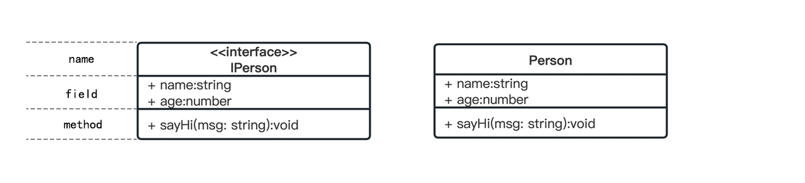
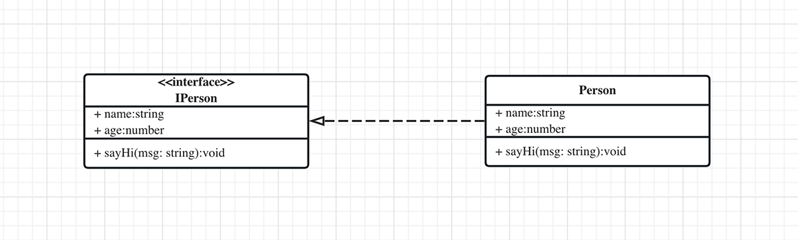
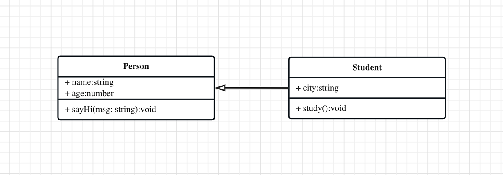
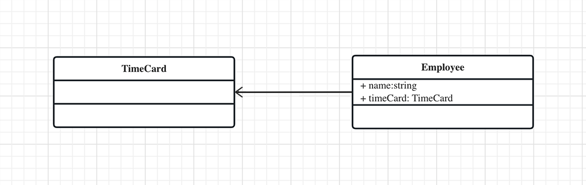
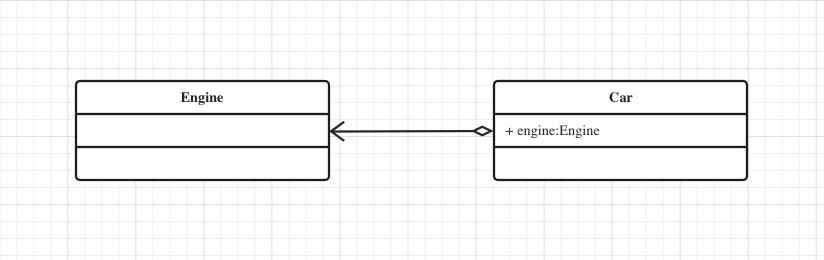
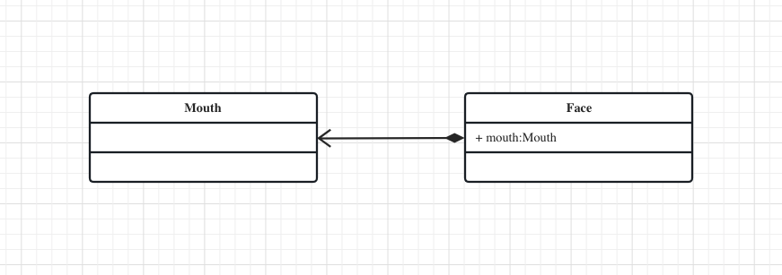
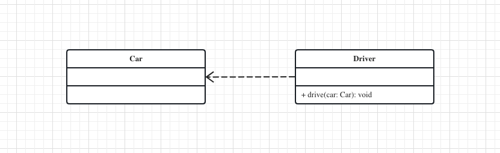

# UML 类图

类图是面向对象编程的核心建模工具。它描述了对象的类型，以及它们之间存在的各种静态关系。

## 类图的结构

<p align="center"></p>

类图由三个区域组成：
- 名称：类/接口的名称；当类是接口时，需要在名称的上一行添加`<<interface>>`。
- 属性：结构为 `[visibility attr] fieldName: dataType`。
- 方法：结构为 `[visibility attr] methodName(arg1Name: dataType, ...): returnDataType`。

在属性和方法的开头是`访问修饰符（visibility attr）`：
- “+”表示`public`；
- “-”表示`private`；
- “#”表示`protected`；
- 缺省值，同“+”，表示`protected`。

## 类之间的关系

接口、类之间存在一定的关系。UML类图中一般会用连线指明它们。

### 实现（Implementation）

`接口与其实现类`之间的关系，用实现表示。

用`空心三角`和`虚线`组成的箭头来表示实现关系；箭头指向`接口`。

<p align="center"></p>

```ts
interface IPerson {
  name: string;
  age: number;
  sayHi(msg: string): void;
}

class Person implements IPerson {
  name: string;
  age: number;

  constructor (name: string, age: number) {
    this.name = name
    this.age = age
  }

  sayHi (msg: string): void {
    console.log(`${this.name} say: "${msg}"`)
  }
}
```

### 泛化（Generalization）

类与类之间是`继承`的关系，则用泛化（is a）表示。

用`空心三角`和`实线`组成的箭头来表示泛化关系；箭头指向`父类`。

<p align="center"></p>

```ts
class Person {
  name: string;
  age: number;

  constructor (name: string, age: number) {
    this.name = name
    this.age = age
  }

  sayHi (msg: string): void {
    console.log(`${this.name} say: "${msg}"`)
  }
}

class Student extends Person {
  score: number;

  constructor (name: string, age: number, score: number) {
    super(name, age)
    this.score = score
  }

  printScore () {
    console.log(this.score)
  }
}
```

学生“is a”人类。“学生”继承了“人类”的所有特性，“人类”是父类，“学生”是子类。

### 关联（Association）

如果一个对象含有另一个对象的引用，则用关联表示。

用`实线箭头`表示`关联关系`；箭头指向`被关联的对象`。

<p align="center"></p>

```ts
class TimeCard {}

class Employee {
  name: string;
  timeCard: TimeCard;

  constructor (name: string, timeCard: TimeCard) {
    this.name = name
    this.timeCard = timeCard
  }
}
```

> `关联关系`又可以分为三种：`聚合关系`、`组合关系`和`依赖关系`。

### 聚合（Aggregation）

聚合（has a）关系是关联关系的一种，体现的是整体与部分的拥有关系：整体包含部分，部分可以脱离整体而单独存在。

用`空心菱形`和`实线箭头`来表示聚合；空心菱形指向`整体`，箭头指向`部分`。

<p align="center"></p>

```ts
class Engine {}

class Car {
  engine: Engine

  constructor (engine: Engine) {
    this.engine = engine
  }
}
```

发动机、底盘、变速箱等等零部件，可以组装一辆汽车。发动机和汽车的关系不是必须的。发动机也可以拆下来，供发电机使用。

### 组合（Composition）

组合（contains a）关系是关联关系的一种，体现的是整体与部分的拥有关系：整体包含部分，部分不可以脱离整体。

用`实心菱形`和`实线箭头`来表示关联；实心菱形指向`整体`，箭头指向`部分`。

<p align="center"></p>

```ts
class Mouth {}

class Face {
  mouth: Mouth;

  constructor (mouth: Mouth) {
    this.mouth = mouth
  }
}
```

人包含头、躯干、四肢，它们的生命周期一致。当人出生时，头、躯干、四肢同时诞生。当人死亡时，作为人体组成部分的头、躯干、四肢同时死亡。

### 依赖（Dependency）

如果在一个对象的方法中使用了另一个对象，例如：函数参数或函数返回值。则用依赖（use a）表示。

用`虚线箭头`表示依赖；箭头指向`被使用的对象`。

<p align="center"></p>

```ts
class Car {}

class Driver {
  drive (car: Car) {}
}
```

驾驶员使用汽车，两者就是依赖关系。
