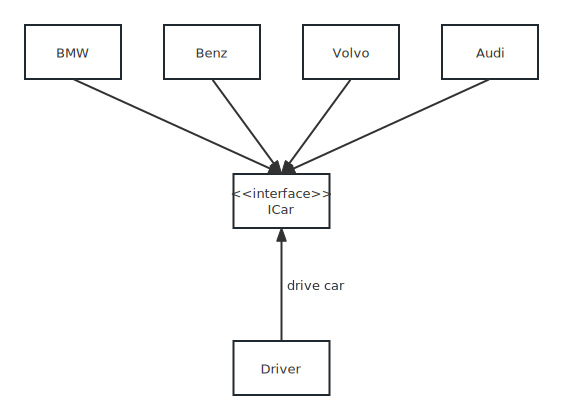

# 面向对象的SOLID设计原则

在程序设计领域，罗伯特·C·马丁指出了`面向对象编程`和`面对对象设计`的五大基本原则：SOLID。开发一个系统时，如果应用这些原则，将会让系统变得更加易于维护和扩展。

SOLID是由五个设计原则的首字母组成的：

- S - 单一职责原则 - Single Responsibility Principle
- O - 开放封闭原则 - Open Close Principle
- L - 里氏替换原则 - Liskov Substitution Principle
- I - 接口分离原则 - Interface Segregation Principle
- D - 依赖倒置原则 - Dependency Inversion Principle

下面就SOLID五大设计原则，一起来看看。

## S：单一职责原则（Single Responsibility Principle）

> 一个类（模块、函数等），只有一个职责；将多职责的类拆分为多个类，保持各个类的相互独立。

> 好处：提高代码的可读性和可维护性，降低代码的复杂度，减少修改代码的影响范围。

任何代码都有可能修改。如果在一个类中实现多个不相干的职责，那么在修改其中一个职责的相关代码时，很有可能影响到其他职责的相关代码，造成这个类的不稳定影响范围变大。

因此需要将多职责的类拆分为单职责的类，即使某一个职责相关代码需要修改，其影响范围仅限于这个类，其他职责的代码不受这个职责代码修改的影响。

例如：

```ts
// 一个光猫类，有两个职责：一个是管理连接（dial和hangup）；一个是数据传输（send和receive）
class Model {
  dial(pno: string) {}
  hangup() {}
  send(msg: string) {}
  receive(data: string) {}
}

// 通常这两个职责并没有共同点，在一个类中实现，过于耦合。应该将其分开到两个相对独立的类中，分别维护。
class Connection {
  dial(pno: string) {}
  hangup() {}
}

class DataChannel {
  send(msg: string) {}
  receive(data: string) {}
}

class Model {
  constructor() {
    const connection = new Connection();
    const dataChannel = new DataChannel();
  }
}
```

## O：开放封闭原则（Open Close Principle）

> 当添加一个新的功能时，应该在已有代码的基础上扩展代码（新增模块、类、函数等），而不是修改已有的代码（修改模块、类、函数等）。

> 好处：提高代码的稳定性和灵活性。

例如：

```ts
// 有两种电脑：苹果电脑和华硕电脑。这两种电脑都继承Computer类。
class Computer {
  getPrice() {}
}

class MacComputer extends Computer {}
class AsusComputer extends Computer {}

// 当双十一打折促销时，需要对电脑实现降价销售。此时不应该修改类的代码，而是应该扩展一个打折类。
class AsusDiscountComputer extends AsusComputer {
  getDiscountPrice() {}
}

// 当双十一购物节过去后，AsusDiscountComputer类不再需要时，直接删除即可。
```

## L：里氏替换原则（Liskov Substitution Principle）

子类可以`完全`替换父类；父类能出现的地方，子类也可以出现。

例如：

```js
// 创建一个Bird类，假设所有的鸟都会飞
class Bird {
  fly() {}
}

const allFly = (birds) => birds.forEach((bird) => bird.fly());

allFly([new Bird(), new Bird(), new Bird()]);

// 扩展三个子类：鸭子、鹦鹉、天鹅
class Duck extends Bird {
  quack() {}
}

class Parrot extends Bird {
  repeat() {}
}

class Swan extends Bird {
  beBeautiful() {}
}

allFly([new Duck(), new Parrot(), new Swan()]);

// 再添加一只企鹅，但是企鹅并不会飞，如果想调用fly方法，我们就抛出一个错误
class Penguin extends Bird {
  fly() {
    throw new Error('Sorry, but I cannot fly');
  }
  swim() {}
}

allFly([new Duck(), new Parrot(), new Swan(), new Penguin()]); // Error: Sorry, but I cannot fly.

// fly方法并不期望出现内部错误，allFly方法也只是为会飞的鸟创建的。企鹅不会飞，所以我们违背了里氏替换原则
// 会飞的鸟与不会飞的鸟不能继承同一个Bird类。需要创建一个FlyingBird类供会飞的鸟继承
class Bird {}

class FlyingBird {
  fly() {}
}

class Duck extends FlyingBird {
  quack() {}
}

class Parrot extends FlyingBird {
  repeat() {}
}

class Swan extends FlyingBird {
  beBeautiful() {}
}

class Penguin extends Bird {
  swim() {}
}
```

## I：接口分离原则（Interface Segregation Principle）

客户端不应该依赖他们不使用的接口(接口应该是精简的，拥有尽可能少的行为)。

例如：

```ts
// 有一个名为 Troll 的类，它实现了一个名为 Character 的接口，但是 Troll 既不会游泳也不会说话，所以它似乎不太适合实现我们的接口。
interface Character {
  shoot(): void;
  swim(): void;
  talk(): void;
  dance(): void;
}

class Troll implements Character {
  shoot(): void {
    // some method
  }

  swim(): void {
    // a troll can't swim
  }

  talk(): void {
    // a troll can't talk
  }

  dance(): void {
    // some method
  }
}

// 遵循接口隔离原则，删除 Character 接口并将它的功能拆分为四个接口，然后 Troll 类只需要依赖于实际需要的这些接口。
interface Talker {
  talk(): void;
}

interface Shooter {
  shoot(): void;
}

interface Swimmer {
  swim(): void;
}

interface Dancer {
  dance(): void;
}

class Troll implements Shooter, Dancer {
  shoot(): void {
    // some method
  }

  dance(): void {
    // some method
  }
}
```

## D：依赖倒置原则（Dependency Inversion Principle）

基本定义是：

- 高层模块不应该依赖低层模块，应该共同依赖抽象。
- 抽象不应该依赖细节，细节应该依赖抽象。

这里的抽象就是接口和抽象类，而细节就是实现接口或继承抽象类而产生的类。

<p align="center"></p>

```ts
// 比如宝马BMW类、奔驰Benz类都有一个drive方法，然后Driver类通过依赖倒置的方式去实现开不同的车。

// 抽象
interface ICar {
  brand: string;
  drive(): void;
}

interface IDriver {
  setCar(car: ICar): void;
  drive(car: ICar): void;
}

// 细节
class Driver implements IDriver {
  private car: ICar;

  constructor(car: ICar) {
    this.car = car;
  }

  setCar(car: ICar) {
    this.car = car;
  }

  drive() {
    this.car.drive();
  }
}

class BMW implements ICar {
  brand: string;

  constructor(brand: string) {
    this.brand = brand;
  }
  drive() {}
}

class Benz implements ICar {
  brand: string;

  constructor(brand: string) {
    this.brand = brand;
  }
  drive() {}
}

const li740 = new BMW('BMW');
const s600 = new Benz('Benz');

const driver = new Driver(li740);
driver.setCar(s600); // replace li740 with s600
```

## 总结

- 单一职责：实现类需要职责单一。
- 里氏替换原则：不要破坏继承体系。
- 接口隔离原则：设计的接口要精简。
- 依赖倒置原则：面向接口编程。
- 【总纲】开放封闭原则：对扩展开放，对修改关闭。

人无完人，金无足赤。理论结合实际，不要刻意追求完美，而是要在适当的场景遵循适当的设计原则，体现出一种平衡的取舍。帮助我们设计出更加优雅的代码结构。
