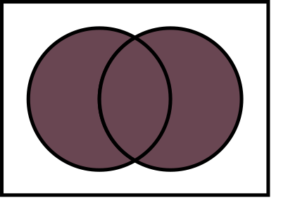
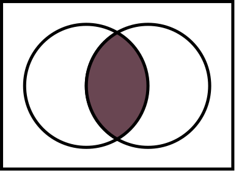

# browserslist 使用简介

页面为了能在各个品牌、各个版本的浏览器上正常显示，需要处理各种兼容问题：将现代的 JavaScript 语法（ESNext）转译为旧版的 JavaScript 语法（ES5）；为不兼容的 CSS 样式添加浏览器前缀（-webkit-、-moz-）；等等。

现代的前端页面开发流程，都有相应的工具为开发者自动地处理这些兼容问题：Autoprefixer - 为 CSS 样式，自动添加不兼容的浏览器前缀；Babel - 将 JavaScript 语法转译为浏览器兼容的旧版语法；等等。

但这些工具，都需要有一个浏览器的兼容范围，来指导它们何种颗粒度地处理兼容问题：是兼容最新的 Chrome 浏览器就可以了？还是兼容 95%用户所使用的浏览器？或者其他情况？

庆幸的是，这些工具都支持统一的方式来指定浏览器范围 —— browserslist。

## 介绍

browserslist 使用 [caniuse-lite](https://github.com/browserslist/caniuse-lite)（[caniuse](https://github.com/Fyrd/caniuse)的简化版）的数据，按照筛选的信息，计算出浏览器的范围。

例如：

中国用户占有率大于 5%的浏览器 `> 5% in cn`

browserslist 计算出了浏览器范围 => `Chrome for Android 129、UC Browser for Android 15.5、Safari on iOS 17.5`

Autoprefixer、Babel 这些工具，根据 browserslist 计算出的浏览器范围，决定哪些语法需要处理兼容问题：CSS 属性 transform 是否需要添加浏览器前缀（-webkit-、-moz-）；let、const 变量声明是否转译为 var；等等。

## 使用

browserslist 筛选语句结构：`query[combiner query][combiner query]...`

> query 是查询；combiner 是连接器。

### query（查询）

#### > 5%

在全球范围内，用户量大于 5% 的浏览器。

#### \>= 0.1% in cn

在中国范围内，用户量大于 0.1% 的浏览器。

> ！！以该地区为统计维度，而不是全球（例如，中国地区，就以中国的所有数据为统计量，不考虑全球的数据）

##### 在 browserslist 中国家、地区的缩写

常用示例：

- cn - China
- us - USA
- alt-af - Africa
- alt-as - Asia
- alt-eu - Europe
- alt-na - North America

> 大小写不敏感

[详细列表可以查看 caniuse/region-usage-json](https://github.com/Fyrd/caniuse/tree/main/region-usage-json)

#### last 2 versions / last 2 major versions

筛选出：每个品牌的浏览器中，最后发布的两个版本（或主版本）。

例如，对于 Safari 浏览器：

- last 2 versions - 18.0 / 17.6
- last 2 major versions - 17.x ~ 18.x 范围内的所有版本

#### last 2 Safari versions / last 2 Safari major versions

与`last 2 versions / last 2 major versions`相比，限制了浏览器品牌。

##### browserslist 中使用的浏览器标识符

| 浏览器名称        | Desktop         | Android                   | iOS             | Other Mobile      |
| ----------------- | --------------- | ------------------------- | --------------- | ----------------- |
| Android (WebView) |                 | `Android`                 |                 |                   |
| Baidu             | `Baidu`         |                           |                 |                   |
| BlackBerry        |                 |                           |                 | `BlackBerry` `bb` |
| Chrome            | `Chrome`        | `ChromeAndroid` `and_chr` | ↪︎ `ios_saf`   |                   |
| Edge              | `Edge`          | ↪︎ `and_chr`             | ↪︎ `ios_saf`   |                   |
| Electron          | `Electron`      |                           |                 |                   |
| Firefox           | `Firefox` `ff`  | `FirefoxAndroid` `and_ff` | ↪︎ `ios_saf`   |                   |
| Internet Explorer | `Explorer` `ie` |                           |                 | `ie_mob`          |
| Node.js           | `Node`          |                           |                 |                   |
| KaiOS Browser     |                 |                           |                 | `kaios`           |
| Opera             | `Opera`         | `op_mob`                  | ↪︎ `ios_saf`   |                   |
| Opera Mini        |                 | `OperaMini` `op_mini`     |                 |                   |
| QQ browser        |                 | `and_qq`                  |                 |                   |
| Safari            | `Safari`        |                           | `iOS` `ios_saf` |                   |
| Samsung Internet  |                 | `Samsung`                 |                 |                   |
| UC Browser        |                 | `UCAndroid` `and_uc`      |                 |                   |

- `↪︎ name` 该浏览器的内核是`name`，在 browserslist 查询该浏览器时，按`name`查询。
- 在 IOS 设备上，所有的浏览器的内核都是系统的 WebKit。
- 在 Android 设备上，上述浏览器中除`Firefox`是`Gecko`内核，其他浏览器都是`Blink`内核（Chrome 浏览器就是 Blink 内核）；这些其他的浏览器中，可能会使用系统的 WebView，也有可能浏览器内嵌一个 Blink 内核。

#### unreleased versions / unreleased Chrome versions

未发布的浏览器，包含 alpha 和 beta 版本。 / 未发布的 Chrome 浏览器，包含 alpha 和 beta 版本。

#### since 2021-01-15 / since 2020-01 / since 2020 / last 3 years

根据浏览器的发布时间，筛选出符合时间要求的浏览器版本。

#### cover 99.5% / cover 99.5% in cn

在全球范围内（或指定地区），按照浏览器的用户占比从大到小排列，累加用户占比，直到符合要求为止。

#### iOS >= 13.2

Safari on IOS 版本大于或等于 13.2

#### supports

`fully supports es6-module` - 全部支持 es6-module 的浏览器

`partially supports css-grid` - 部分支持 css-grid 的浏览器

格式：`fully supports {certain_feature}` / `partially supports {certain_feature}`

[详细列表可以查看 caniuse/features-json](https://github.com/Fyrd/caniuse/tree/main/features-json)

#### dead

24 个月没有官方支持或更新的浏览器：

- Baidu >= 0
- ie <= 11
- ie_mob <= 11
- bb <= 10
- op_mob <= 12.1
- samsung 4

#### Firefox ESR

最新的火狐 ESR（长期支持版） 版本的浏览器。

### combiner（连接器）

连接各个 query，分为三个连接器：

- or / ,
- and
- not

| combiner type         | 示意图                | 例子                                                                       |
| --------------------- | --------------------- | -------------------------------------------------------------------------- |
| `or / ,`（union）     |  | `> .5%, last 2 versions`                                                   |
| `and`（intersection） |  | `> .5% and last 2 versions`                                                |
| `not`（negation）     |  | `> .5%, not dead`（在用户占有率大于 0.5%的范围内，去掉已经不支持的浏览器） |

> `not`需要联系前面的 query，因此不能位列第一位。

> `not`不关心前面的连接符，`> .5% or not dead`、`> .5% , not dead`、`> .5% and not dead`这三个语句的含义都是一样的。

### defaults

browserslist 中的最佳实践：在没有更好的查询条件情况下，`defaults`可以很好地覆盖用户浏览器范围。

其代表的查询列表为：`> 0.5%, last 2 versions, Firefox ESR, not dead`

## 查询网站

可以通过[在线网站](https://browsersl.ist/)，快捷地查询目标浏览器的范围，以及用户占有率。

## 总结

browserslist 只是查询 caniuse 数据的一个工具，通过查询语句，可以很好地为开发者提供目标浏览器的范围。
