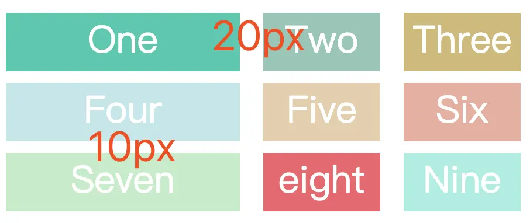

# CSS - grid 简介以及常用属性介绍

利用`grid`布局可以高效地实现二维布局。但是其众多的属性以及属性值，让很多刚刚接触的人和没有系统性总结的人云里雾里，这增加了使用`grid`的成本。

为此，从实用角度出发，按照类别，系统性地总结了日常开发常用的知识点。

## 网格容器属性

### 声明元素为网格布局

通过 `display: grid` 声明某个元素为网格布局：

```css
.wrapper {
  /* 声明一个容器 */
  display: grid;
  /*  声明列的宽度  */
  grid-template-columns: repeat(3, 200px);
  /*  声明行间距和列间距  */
  gap: 20px;
  /*  声明行的高度  */
  grid-template-rows: 100px 200px;
}
```

### grid-template-columns / grid-template-rows

`grid-template-columns`定义网格中 `列` 的宽度。`grid-template-rows`定义网格中 `行` 的宽度。

下面以 `grid-template-columns` 做说明（`grid-template-rows` 的用法与之类似，就不必重复说明了）

#### 固定宽度

```css
.wrapper {
  display: grid;
  /*  声明了三列，宽度分别为 200px 100px 200px */
  grid-template-columns: 200px 100px 200px;
  gap: 5px;
  /*  声明了两行，行高分别为 50px 50px  */
  grid-template-rows: 50px 50px;
}
```

#### repeat() 函数

简化重复的值。

语法：`repeat(repeat_number, length)`。

```css
.wrapper {
  display: grid;
  grid-template-columns: 200px 100px 200px;
  gap: 5px;
  /*  2行，而且行高都为 50px  */
  grid-template-rows: repeat(2, 50px);
}
```

#### auto-fill 关键字

表示自动填充，让一行（或者一列）中尽可能的容纳更多的单元格。

`grid-template-columns: repeat(auto-fill, 200px)` 表示列宽是 200 px，但列的数量是不固定的，只要浏览器能够容纳得下，就可以放置元素，代码以及效果如下图所示：

```css
.wrapper {
  display: grid;
  grid-template-columns: repeat(auto-fill, 200px);
  gap: 5px;
  grid-auto-rows: 50px;
}
```

<p align="center"></p>

#### fr 关键字

`fr` 单位代表网格容器中可用空间的一个等份。`grid-template-columns: 200px 1fr 2fr` 表示第一个列宽设置为 200px，后面剩余的宽度分为两部分，宽度分别为剩余宽度的 1/3 和 2/3。代码以及效果如下图所示：

```css
.wrapper {
  display: grid;
  grid-template-columns: 200px 1fr 2fr;
  gap: 5px;
  grid-auto-rows: 50px;
}
```

<p align="center"></p>

#### minmax() 函数

`minmax()` 函数产生一个长度范围，表示长度就在这个范围之中都可以应用到网格项目中。它接受两个参数，分别为最小值和最大值。`grid-template-columns: 1fr 1fr minmax(300px, 2fr)` 的意思是，第三个列宽最少也是要 300px，但是最大不能大于第一第二列宽的两倍。代码以及效果如下：

语法：`minmax(min_length, max_length)`。

```css
.wrapper {
  display: grid;
  grid-template-columns: 1fr 1fr minmax(300px, 2fr);
  gap: 5px;
  grid-auto-rows: 50px;
}
```

<p align="center"></p>

#### auto 关键字

由浏览器决定长度。通过 `auto` 关键字，可以轻易实现三列或者两列布局。`grid-template-columns: 100px auto 100px` 表示第一第三列为 100px，中间由浏览器决定长度，代码以及效果如下：

```css
.wrapper {
  display: grid;
  grid-template-columns: 100px auto 100px;
  gap: 5px;
  grid-auto-rows: 50px;
}
```

<p align="center"></p>

### gap / column-gap / row-gap

`row-gap` 属性设置`行间距`。

`column-gap` 属性设置`列间距`。

`gap` 属性是上面两者的简写形式：`row-gap` `column-gap`。

```css
.wrapper {
  display: grid;
  grid-template-columns: 200px 100px 100px;
  gap: 10px 20px;
  grid-auto-rows: 50px;
}
```

<p align="center"></p>

### grid-auto-flow

默认的放置顺序是“`先行后列`“：先填满第一行，再开始放入第二行，即下图英文数字的顺序 `one`,`two`,`three`...。这个顺序由 `grid-auto-flow` 属性决定。

语法：

<!-- prettier-ignore-start -->
```css
grid-auto-flow: row;            // 先行后列（默认值）
grid-auto-flow: column;         // 先列后行
grid-auto-flow: row dense;      // 先行后列，尽可能填满表格
grid-auto-flow: column dense;   // 先列后行，尽可能填满表格
```
<!-- prettier-ignore-end -->

`grid-auto-flow: row`：

<p align="center"></p>

为了尽可能填满表格，使用 `grid-auto-flow: row dense` 可以填充上图中 `Three` 和 `Seven` 之间的空白。效果如下所示：

<p align="center"></p>

```css
.wrapper {
  display: grid;
  grid-template-columns: 100px 200px 100px;
  grid-auto-flow: row;
  /* grid-auto-flow: row dense; */
  gap: 5px;
  grid-auto-rows: 50px;
}
```

### justify-items / align-items / place-items

`justify-items` 设置网格布局中，所有单元格内容的水平位置（左中右）。

`align-items` 设置网格布局中，所有单元格内容的垂直位置（上中下）。

`place-items` 属性是上面两者的简写形式：`align-items` `justify-items`。

下面以 `justify-items` 做说明（`align-items` 的用法与之类似，就不必重复说明了）

语法：

<!-- prettier-ignore-start -->
```css
justify-items: start;     // 单元格的起始边缘（水平 - 左边 / 垂直 - 上边）
justify-items: center;    // 单元格内部居中
justify-items: end;       // 单元格的结束边缘（水平 - 右边 / 垂直 - 下边）
justify-items: stretch;   // 默认值。占满单元格的某一维度的全部空间（水平 or 垂直）
```
<!-- prettier-ignore-end -->

`justify-items: start` - 单元格的起始边缘（水平 - 左边 / 垂直 - 上边）：

<p align="center"></p>

`justify-items: end` - 单元格内部居中：

<p align="center"></p>

`justify-items: center` - 单元格的结束边缘（水平 - 右边 / 垂直 - 下边）：

<p align="center"></p>

`justify-items: stretch` - 默认值。占满单元格的某一维度的全部空间（水平 or 垂直）：

<p align="center"></p>

```css
.wrapper {
  display: grid;
  grid-template-columns: 100px 200px 100px;
  gap: 5px;
  grid-auto-rows: 50px;
  justify-items: start;
}
```

### grid-auto-columns / grid-auto-rows

`grid-template-columns` 和 `grid-template-rows` 这两个属性构成了网格容器的`行数`和`列数`。

如果实际的单元格数量，超过了由 `grid-template-columns` 和 `grid-template-rows` 构成的单元格数量，那么这些`额外单元格`的`行高`、`列宽`如何约定呢？

<p align="center"></p>

这就需要由 `grid-auto-columns` / `grid-auto-rows` 来确定了：

- `grid-auto-columns` 确定`额外单元格`的`列宽`（默认值为 auto，自动适配内容的最大宽度）
- `grid-auto-rows` 确定`额外单元格`的`行高`（默认值为 auto，自动适配内容的最大宽度）

当 `grid-auto-flow` 为 `row` 时，单元格按照 `先行后列` 顺序填充网格：`额外单元格` 的`列宽` 由 `grid-template-columns` 确定；`行高` 就由 `grid-auto-rows` 确定。

<p align="center"></p>

```css
.wrapper {
  margin: 50px;
  display: grid;
  grid-template-columns: 200px 100px;
  /*  只设置了两行，但实际的数量会超出两行，超出的行高会以 grid-auto-rows 算 */
  grid-template-rows: 100px 100px;
  grid-gap: 10px 20px;
  grid-auto-rows: 40px;
}
```

当 `grid-auto-flow` 为 `column` 时，单元格按照 `先列后行` 顺序填充网格：`额外单元格` 的 `行高` 由 `grid-template-rows` 确定；`列宽` 就由 `grid-auto-columns` 确定。

<p align="center"></p>

```css
.wrapper {
  margin: 50px;
  display: grid;
  grid-template-columns: 200px 100px;
  grid-auto-flow: column;
  /*  只设置了两列，但实际的数量会超出两列，超出的列宽会以 grid-auto-columns 算 */
  grid-template-rows: 100px 100px;
  grid-gap: 10px 20px;
  grid-auto-columns: 80px;
}
```

## 网格项目属性

### grid-column-start / grid-column-end / grid-row-start / grid-row-end

指定网格项目所在的四个边框，分别定位在哪根网格线，从而指定项目的位置。网格线的序号：

- 从左到右，由 1 开始依次递增。
- 从上到下，由 1 开始依次递增。

<p align="center"></p>

- `grid-column-start` 属性：网格项目左边框所在的垂直网格线
- `grid-column-end` 属性：网格项目右边框所在的垂直网格线
- `grid-row-start` 属性：网格项目上边框所在的水平网格线
- `grid-row-end` 属性：网格项目下边框所在的水平网格线

上图`Five`的样式：

```css
.wrapper {
  display: grid;
  grid-template-columns: repeat(3, 1fr);
  gap: 20px;
  grid-auto-rows: minmax(100px, auto);
}

.five {
  grid-column-start: 2;
  grid-column-end: 3;
  grid-row-start: 2;
  grid-row-end: 5;
  background: #e6ceac;
}
```

#### span 关键字

上述四个属性的值还可以使用 span 关键字，表示"跨越"，即左右边框（上下边框）之间跨越多少个网格。

```css
.item-1 {
  grid-column-start: span 2;
}
```

上面代码表示，1 号项目的左边框距离右边框跨越 2 个网格。

<p align="center"></p>

### justify-self / align-self / place-self

`justify-self` / `align-self` / `place-self` 与 [justify-items / align-items / place-items](#justify-items--align-items--place-items) 属性的用法是一样的，**只是 `justify-self` / `align-self` / `place-self` 作用于单个网格项目**。

## grid-template-areas / grid-area

网格容器属性 `grid-template-areas` 在`网格容器`中定义具有语义化的`区域`，**一个区域由一个或者多个单元格组成**。

网格项目属性 `grid-area` 指定项目放在网格容器的哪一个区域。

例如下面的代码：

网格容器划分出 6 个单元格，其中值得注意的是 `.` 符号代表空的单元格，也就是没有用到该单元格。

样式类 .sidebar .content .header 所在的元素放在上面 grid-template-areas 中定义的 sidebar content header 区域中

```css
.wrapper {
  display: grid;
  grid-gap: 10px;
  grid-template-columns: 120px 120px 120px;
  grid-template-areas:
    '. header  header'
    'sidebar content content';
  background-color: #fff;
  color: #444;
}

.sidebar {
  grid-area: sidebar;
}

.content {
  grid-area: content;
}

.header {
  grid-area: header;
}
```

<p align="center"></p>

> 将网格项目指定到某个区域，不会随着添加/删除网格项目，而导致其位置发生改变。

## 日常使用注意事项

`align-items`默认值是`stretch`，会导致每个单元格 dom 元素的高度被撑满，不是 dom 元素原本的高度。为了使单元格 dom 元素的高度还原为实际的高度，建议在使用`grid`时，先进行如下的初始化：

```css
.wrapper {
  display: grid;
  align-items: start;
}
```

## 参考

[最强大的 CSS 布局 —— Grid 布局](https://juejin.cn/post/6854573220306255880)
