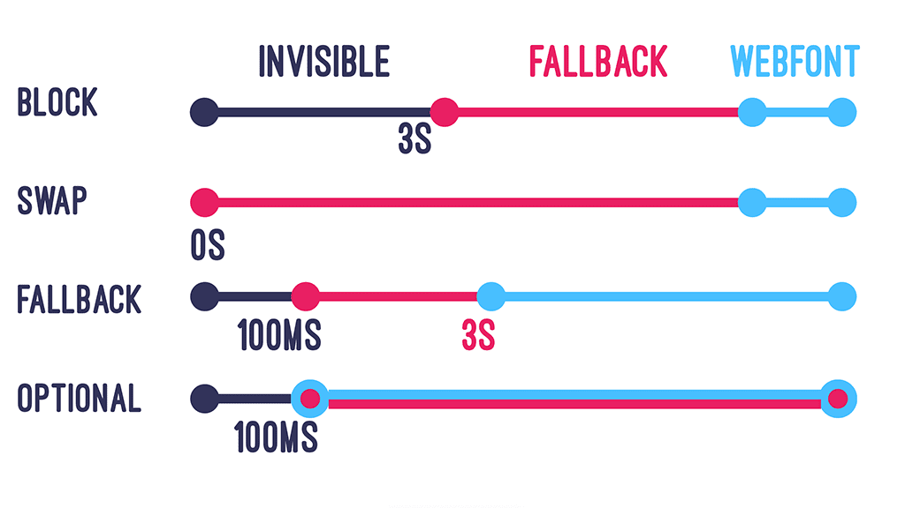

# 网络字体（Web Fonts）是如何渲染页面中字体的

## font-family 简单介绍

通过 font-family 为元素中的字体设定字体族名列表（`从左到右，字体族名的优先级依次降低`）；如果当前的字体未能找到，则继续查找下一个`后备字体（Fallback Font）`。

在字体族名中：

- 操作系统内置的字体，称为`安全字体（Web Safe Fonts）`；这些字体天生就存在某个操作系统，例如：`Helvetica（macOS）`、`Helvetica Neue（macOS）`、`Arial`、`PingFang SC（macOS）`、`Microsoft YaHei（Windows）`、`WenQuanYi Micro Hei（Linux）`等等。

- `网络字体（Web Fonts）`，通过网络加载第三方提供的字体，个性化地渲染页面中的字体；例如：`HarmonyOS Sans`等等。

> 在 font-family 中，越靠后的字体越普遍，例如：`sans-serif`。

## 网络字体（Web Fonts）是如何加载的

网络字体需要通过网络加载，具有一定的延迟。按照顺序会有三个时期：

- 阻塞期（Block Period）

  - 字体加载未完成 —— 使用`font-family`字体列表中的`后备字体（Fallback Font）`进行渲染；会占据页面空间，但显示为空白，用户不可见。
  - 字体加载完成 —— 立即使用该字体渲染页面。

- 交换期（Swap Period）

  - 字体加载未完成 —— 使用`font-family`字体列表中的`后备字体（Fallback Font）`进行渲染；用户可见。
  - 字体加载完成 —— 立即使用该字体渲染页面。

- 失败期（Failure Period）
  - 字体加载失败 —— 使用`后备字体（Fallback Font）`进行渲染。

`font-display`内置了几个属性值：可以控制字体在显示过程中，上面三个阶段的时长。

## font-display

`font-display`是专门用于`@font-face`的描述符：描述`网络字体（Web Fonts）`在加载过程中，上面三个阶段的时长。

```css
@font-face {
  font-family: ExampleFont;
  src:
    url(/path/to/fonts/examplefont.woff) format('woff'),
    url(/path/to/fonts/examplefont.eot) format('eot');
  font-weight: 400;
  font-style: normal;
  font-display: fallback;
}
```

<p align="center"></p>

### auto

当前，大多数浏览器的默认策略都类似于 block。

### block

分为两个阶段：`阻塞期（Block Period）`、`交换期（Swap Period）`。

> `阻塞期（Block Period）`为 3 秒；`交换期（Swap Period）`为无限时长；没有`失败期（Failure Period）`。

<p align="center"></p>

### swap

分为两个阶段：`阻塞期（Block Period）`、`交换期（Swap Period）`。

> `阻塞期（Block Period）`为 0 秒；`交换期（Swap Period）`为无限时长；没有`失败期（Failure Period）`。

<p align="center"></p>

### fallback

分为三个阶段：`阻塞期（Block Period）`、`交换期（Swap Period）`、`失败期（Failure Period）`。

> `阻塞期（Block Period）`为 100 毫秒；`交换期（Swap Period）`为 3 秒；如果超过 3.1 秒，还未加载完字体，就进入`失败期（Failure Period）`，使用`后备字体（Fallback Font）`进行渲染。

<p align="center"></p>

### optional

分为两个阶段：`阻塞期（Block Period）`、`失败期（Failure Period）`。

> `阻塞期（Block Period）`为 100 毫秒；如果超过 0.1 秒，还未加载完字体，就进入`失败期（Failure Period）`，使用`后备字体（Fallback Font）`进行渲染。

<p align="center"></p>

## 总结

对于日常开发中使用到的`font-face`场景，有如下总结：

- 如果使用 web font 作为图标，则应该使用 `font-display:block` 尽可能地阻止字体呈现出来，直到字体准备好为止。

- 如果希望字体稳定地显示，而不需要进行一次重排，则应该使用 `font-display:optional` 。

- 对于大部分情况应该设置为 `font-display:swap` ，这样在加载网络字体期间，使用后备字体进行渲染，加载完成之后再替换为指定的网络字体。
