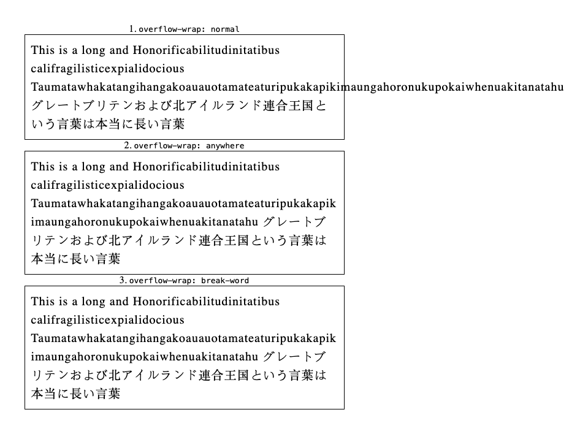
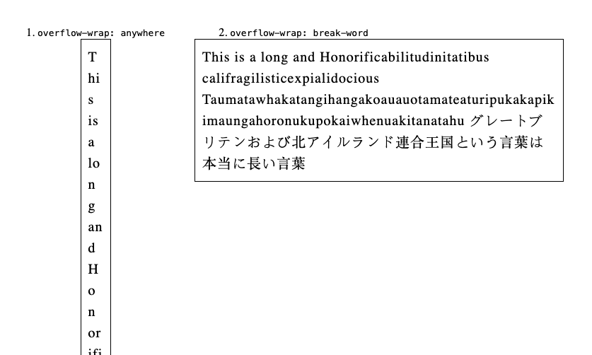
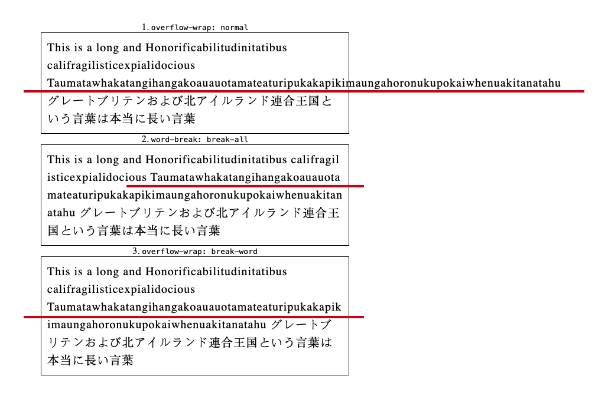
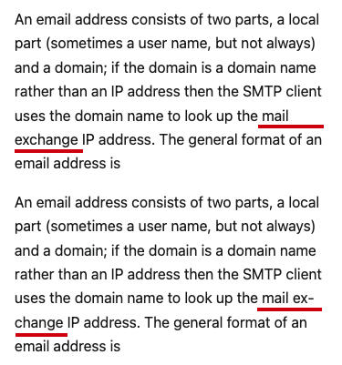

# web 网页中的文案换行逻辑与最佳实践方案（word-break、overflow-wrap、hyphens）

在网页中，英文单词、email 地址、URL 等长度不等的字符串展示时，会有如下展示逻辑：

- 不换行，一行展示到底。
- 换行展示。
- 用连字符连接换行的字符串。

各种情况比较多，该采用哪个方案？先介绍几个相关的 CSS 属性。

## word-break

**word-break** 指定了如何在单词内断行。

属性值：

- normal（`默认值`）：无法对英文单词进行换行；只能在一行内显示；其他情况，都正常换行。
- break-all：允许在`任意点`将`不可断的单词`换行（充分地利用剩余空间，不会另起一行展示）。
- keep-all：`CJK` 文本不断行； `Non-CJK` 文本表现同 `normal`。

<p align="center"></p>

```html
<!DOCTYPE html>
<html lang="en">
  <head>
    <meta charset="UTF-8" />
    <meta name="viewport" content="width=device-width, initial-scale=1.0" />
    <title>Document</title>
    <style>
      * {
        padding: 0;
        margin: 0;
      }

      .narrow {
        padding: 10px;
        border: 1px solid;
        width: 500px;
        margin: 0 auto;
        font-size: 20px;
        line-height: 1.5;
        letter-spacing: 1px;
      }

      .normal {
        word-break: normal;
      }

      .breakAll {
        word-break: break-all;
      }

      .keepAll {
        word-break: keep-all;
      }
    </style>
  </head>

  <body>
    <p style="text-align: center;">1. <code>word-break: normal</code></p>
    <p class="normal narrow">
      This is a long and Honorificabilitudinitatibus
      califragilisticexpialidocious
      Taumatawhakatangihangakoauauotamateaturipukakapikimaungahoronukupokaiwhenuakitanatahu
      グレートブリテンおよび北アイルランド連合王国という言葉は本当に長い言葉
    </p>

    <p style="text-align: center;">2. <code>word-break: break-all</code></p>
    <p class="breakAll narrow">
      This is a long and Honorificabilitudinitatibus
      califragilisticexpialidocious
      Taumatawhakatangihangakoauauotamateaturipukakapikimaungahoronukupokaiwhenuakitanatahu
      グレートブリテンおよび北アイルランド連合王国という言葉は本当に長い言葉
    </p>

    <p style="text-align: center;">3. <code>word-break: keep-all</code></p>
    <p class="keepAll narrow">
      This is a long and Honorificabilitudinitatibus
      califragilisticexpialidocious
      Taumatawhakatangihangakoauauotamateaturipukakapikimaungahoronukupokaiwhenuakitanatahu
      グレートブリテンおよび北アイルランド連合王国という言葉は本当に長い言葉
    </p>
  </body>
</html>
```

## overflow-wrap

**overflow-wrap** 与 **word-break** 作用一样：指定了如何在单词内断行。

> word-wrap 最初是一个没有前缀的微软扩展。它不是 CSS 标准的一部分，尽管大多数浏览器都以 word-wrap 的名字来实现它。根据 CSS3 规范草案，浏览器应该将 word-wrap 作为 overflow-wrap 属性的一个传统名称别名，以利于兼容。

属性值：

- normal（`默认值`）：无法对英文单词进行换行；只能在一行内显示；其他情况，都正常换行。

- break-word：允许在`任意点`将`不可断的单词`换行；在计算最小内容内在大小时不考虑断字引入的软换行机会。

- anywhere：与 break-word 作用类似 —— 允许在`任意点`将`不可断的单词`换行；在计算最小内容内在大小时，会考虑由单词换行引入的软换行机会。

<p align="center"></p>

```html
<!DOCTYPE html>
<html lang="en">
  <head>
    <meta charset="UTF-8" />
    <meta name="viewport" content="width=device-width, initial-scale=1.0" />
    <title>Document</title>
    <style>
      * {
        padding: 0;
        margin: 0;
      }

      .narrow {
        padding: 10px;
        border: 1px solid;
        width: 500px;
        margin: 0 auto;
        font-size: 20px;
        line-height: 1.5;
        letter-spacing: 1px;
      }

      .normal {
        overflow-wrap: normal;
      }

      .anywhere {
        overflow-wrap: anywhere;
      }

      .breakAll {
        overflow-wrap: break-word;
      }
    </style>
  </head>

  <body>
    <p style="text-align: center;">1. <code>overflow-wrap: normal</code></p>
    <p class="normal narrow">
      This is a long and Honorificabilitudinitatibus
      califragilisticexpialidocious
      Taumatawhakatangihangakoauauotamateaturipukakapikimaungahoronukupokaiwhenuakitanatahu
      グレートブリテンおよび北アイルランド連合王国という言葉は本当に長い言葉
    </p>

    <p style="text-align: center;">2. <code>overflow-wrap: anywhere</code></p>
    <p class="anywhere narrow">
      This is a long and Honorificabilitudinitatibus
      califragilisticexpialidocious
      Taumatawhakatangihangakoauauotamateaturipukakapikimaungahoronukupokaiwhenuakitanatahu
      グレートブリテンおよび北アイルランド連合王国という言葉は本当に長い言葉
    </p>

    <p style="text-align: center;">3. <code>overflow-wrap: break-word</code></p>
    <p class="breakAll narrow">
      This is a long and Honorificabilitudinitatibus
      califragilisticexpialidocious
      Taumatawhakatangihangakoauauotamateaturipukakapikimaungahoronukupokaiwhenuakitanatahu
      グレートブリテンおよび北アイルランド連合王国という言葉は本当に長い言葉
    </p>
  </body>
</html>
```

### overflow-wrap:anywhere 与 overflow-wrap:break-word 区别

在计算最小内容内在大小时，会考虑由单词换行引入的软换行机会。

例如：当容器宽度由内容决定时，anywhere 会考虑软换行机会从而表现出很小的宽度；break-word 不会考虑软换行的机会，宽度就是最大宽度。

<p align="center"></p>

```html
<!DOCTYPE html>
<html lang="en">
  <head>
    <meta charset="UTF-8" />
    <meta name="viewport" content="width=device-width, initial-scale=1.0" />
    <title>Document</title>
    <style>
      * {
        padding: 0;
        margin: 0;
      }

      .narrow {
        padding: 10px;
        border: 1px solid;
        max-width: 500px;
        width: min-content;
        margin: 0 auto;
        font-size: 20px;
        line-height: 1.5;
        letter-spacing: 1px;
      }

      .anywhere {
        overflow-wrap: anywhere;
      }

      .breakAll {
        overflow-wrap: break-word;
      }
    </style>
  </head>

  <body>
    <p style="text-align: center;">1. <code>overflow-wrap: anywhere</code></p>
    <p class="anywhere narrow">
      This is a long and Honorificabilitudinitatibus
      califragilisticexpialidocious
      Taumatawhakatangihangakoauauotamateaturipukakapikimaungahoronukupokaiwhenuakitanatahu
      グレートブリテンおよび北アイルランド連合王国という言葉は本当に長い言葉
    </p>

    <p style="text-align: center;">2. <code>overflow-wrap: break-word</code></p>
    <p class="breakAll narrow">
      This is a long and Honorificabilitudinitatibus
      califragilisticexpialidocious
      Taumatawhakatangihangakoauauotamateaturipukakapikimaungahoronukupokaiwhenuakitanatahu
      グレートブリテンおよび北アイルランド連合王国という言葉は本当に長い言葉
    </p>
  </body>
</html>
```

## word-break:break-all 和 overflow-wrap:break-word 区别

- word-break: break-all —— 需要折行展示的长字符串，**不会另起一行**，充分地利用已有的空间。
- overflow-wrap: break-word —— 需要折行展示的长字符串，**会另起一行**，上一行的末尾会有一段空白的空间。

<p align="center"></p>

## 英文单词的换行逻辑

默认情况下，一行的剩余空间不足以展示该英文单词时，会将该英文单词换行展示；而不是采用连字符的方式，分行展示。如下图所示：

- 第一段文字的展示逻辑（浏览器默认逻辑）：`exchange` 展示不下时，另起一行，在下一行展示 `exchange`。
- 第二段文字的展示逻辑（连字符逻辑）：`exchange` 展示不下时，该行展示 `ex-` ，在下一行展示 `change`。

<p align="center"></p>

> 为什么默认换行逻辑为“另起一行“？个人猜想是因为通过上下两行看一个单词，不太容易，会增加文字阅读的脑力成本 😂。

## hyphens

**hyphens**：告知浏览器在换行时如何使用连字符连接单词。

属性值：

- none：即便单词内有建议换行点也不会在那里换行。只会在空白符处换行。

- manual（`默认值`）：只有当单词内存在建议的换行点时，才会在该位置断开单词并使用连字符换行（见下面的“换行符的建议”）。

- auto：由浏览器根据文字语言，自动选择连字符的位置。

> auto 的行为取决于语言是否被正确地设置，以便可以选择适当的断词规则。你必须使用 HTML 属性 lang 指定语言，以确保自动断词在你选择的语言中得到应用。

换行符的建议：

- \&hyphen; 表示“硬”连字符，即无论什么情况下，都会显示连字符。
- \&shy; 表示“软”连字符，即存在换行的场景下，才会显示连字符。

## 总结

基于`上面 CSS 属性的介绍`与`浏览器对英文单词的默认换行逻辑（采用非连字符的方式）`，长单词展示的最佳实践方案：

```css
/* 长单词，另起一行再展示，展示不下再折行展示 */
overflow-wrap: break-word;
```
