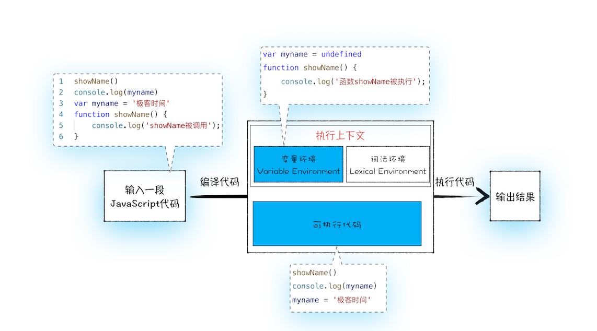
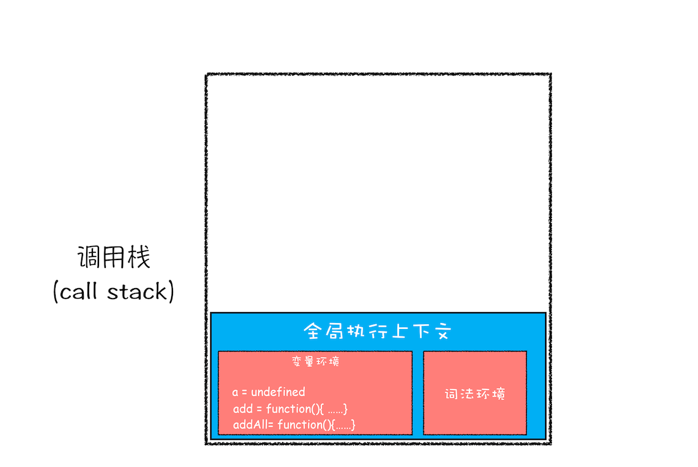
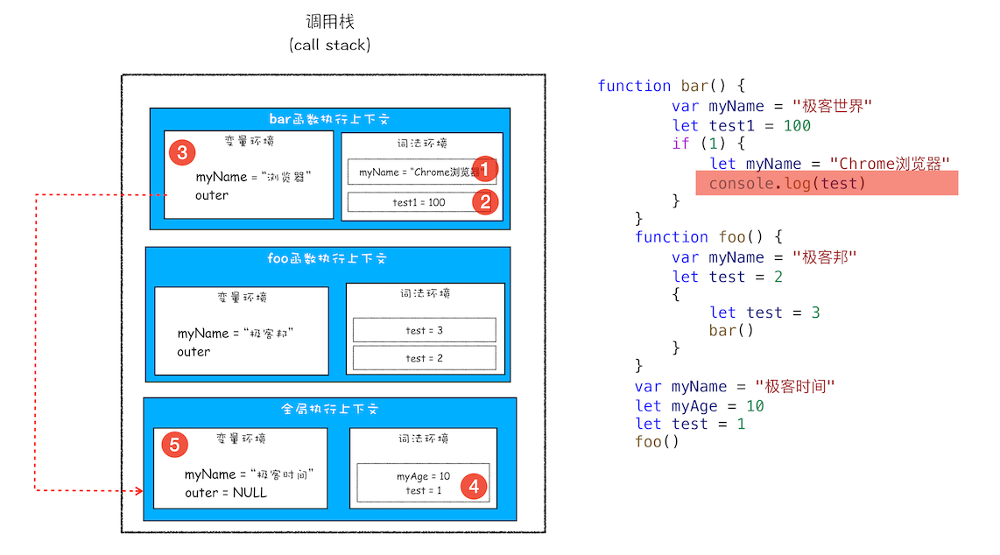
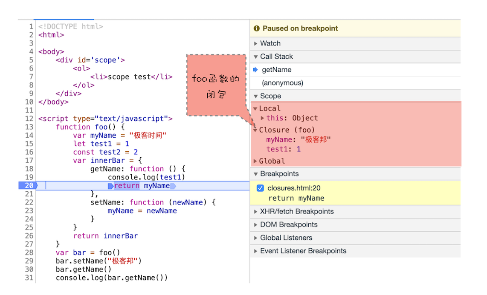

# 浏览器中的JavaScript执行机制

在浏览器中，JavaScript 代码通常是通过若干个 script 标签引入的。而浏览器在执行每个 script 标签时，会有如下特点：

- 每个 script 标签引入的 JavaScript 代码，都是一个宏任务（也就是说，微任务队列必须在下一个script标签执行前，全部执行完毕）。

那么，每个 JavaScript代码的执行机制是什么的呢？接下来详细介绍一下。

## 变量提升

每一段 JavaScript 代码的执行机制：先编译，再执行。

在该执行机制过程中，会将`变量（使用 var 声明）`和`function函数`提升到该段代码的最前面。 具体细节如下：

> 什么是`一段 JavaScript 代码`：script 标签引入的代码、模块内的代码、函数内的代码、eval函数。

### 编译阶段

在`编译阶段`，`变量（使用 var 声明）`和`function函数`会被存放到`变量环境`中。

> 注意点：1.变量的默认值会被设置为 undefined；2.如果存在两个相同名称的function函数，则`变量环境`只会存放最后定义的那个。

### 执行阶段

在`执行阶段`，JavaScript 引擎会从变量环境中去查找自定义的变量和function函数。

### 实例

```js
showName();
console.log(myName);
var myName = 'Tom';
function showName() {
  console.log('showName被调用');
}
```

变量提升后：

```js
var myName = undefined;
function showName() {
  console.log('showName被调用');
}

showName();
console.log(myName);
myName = 'Tom';
```

<p align="center"></p>

## 调用栈

当在全局环境里里执行函数时，就会存在两个`执行上下文`：`全局执行上下文`和`函数的执行上下文`。

JavaScript 引擎通过`调用栈（call stack）`来管理这些执行上下文。

> 栈：一种`后进先出`的数据结构。

调用栈的大概管理流程如下：

1. 每调用一个函数，JavaScript 引擎会为其创建执行上下文，并把该执行上下文压入调用栈，然后 JavaScript 引擎开始执行函数代码。

2. 如果在一个函数 A 中调用了另外一个函数 B，那么 JavaScript 引擎会为 B 函数创建执行上下文，并将 B 函数的执行上下文压入栈顶。

3. 当前函数执行完毕后，JavaScript 引擎会将该函数的执行上下文弹出栈。

4. 当分配的调用栈空间被占满时，会引发“`堆栈溢出`”问题。

### 实例

```js
var a = 2;

function add(b, c) {
  return b + c;
}

function addAll(b, c) {
  var d = 10;
  var result = add(b, c);
  return a + result + d;
}

addAll(3, 6);
```

#### 第一步，创建全局上下文，并将其压入栈底

<p align="center"></p>

执行`a = 2`的赋值操作后：

<p align="center"></p>

#### 第二步是调用 addAll 函数

将 addAll 函数的执行上下文压入栈中。

<p align="center"></p>

执行`d = 10`的赋值操作后，会将 addAll 函数执行上下文中的 d 由 undefined 变成了 10。

#### 第三步，当执行到 add 函数

<p align="center"></p>

#### 当 add 函数返回时

该函数的执行上下文就会从栈顶弹出，并将 result 的值设置为 add 函数的返回值，也就是 9。

<p align="center"></p>

#### 最后

紧接着 addAll 执行最后一个相加操作后并返回，addAll 的执行上下文也会从栈顶部弹出，此时调用栈中就只剩下全局上下文了。

<p align="center"></p>

## 块级作用域

首先介绍一下 JavaScript 中的代码块：

<!-- prettier-ignore-start -->
```js
//if 块
if (1) {}

//while 块
while (1) {}

//for 循环块
for (let i = 0; i < 100; i++) {}

// 单独一个块
{}
```
<!-- prettier-ignore-end -->

以 var 声明的变量，都会无视这些代码块，不论在哪里声明，在编译阶段都会被提升到当前执行上下文的变量环境中。

最常见的例如：

```js
var a = 1;

if (true) {
  var a = 2;
}

console.log(a); // 2
```

由于 JavaScript 的变量提升存在着：变量覆盖、变量污染等设计缺陷，所以 ES6 引入了块级作用域（以 let 和 const 声明的变量都在块级作用域里）来解决这些问题。

### let 和 const 块级作用域实现方式

通过 let 或 const 声明的变量，在编译阶段会将变量存放在执行上下文的`词法环境`中。

> 不同 var ，在 let 和 const 声明变量之前，无法访问该变量，否则会报错。

### 实例

```js
function foo() {
  var a = 1;
  let b = 2;

  {
    let b = 3;
    var c = 4;
    let d = 5;
    console.log(a);
    console.log(b);
  }

  console.log(b);
  console.log(c);
  console.log(d);
}
foo();
```

#### 第一步是编译并创建执行上下文

<p align="center"></p>

#### 第二步继续执行代码

<p align="center"></p>

#### 变量查找过程

在词法环境内部，维护了一个小型的栈结构，栈底是函数最外层的变量：

- 进入一个作用域块后，就会把该作用域块内部的变量压到栈顶。
- 当作用域块执行完成之后，该作用域块内部的变量就会从栈顶弹出。

在执行上下文中，查找变量的过程：

1. 沿着词法环境的栈顶向下查询；如果在`词法环境`中的某个作用域块中查找到了，就直接返回。
2. 如果没有查找到，那么就继续在`变量环境`中查找。

<p align="center"></p>

#### 作用域执行完成示意图

<p align="center"></p>

## 作用域链

上面介绍的内容都是只涉及单个作用域。如果涉及到多个作用域，那么就需要用到作用域链。（作用域链：在当前作用域中查找不到变量，就会向上级作用域查找，直到全局作用域，这种查找关系就是作用域链）

JavaScript 语言的作用域链是由`词法作用域`决定的：`词法作用域`由代码中函数声明的位置来决定的，`词法作用域`是静态的作用域，与函数是怎么调用的没有关系。

<p align="center"></p>

### 实例：块级作用域中是如何查找变量的

```js
var bar = {
  myName: 'time.geekbang.com',
  printName: function () {
    console.log(myName);
  },
};

function foo() {
  let myName = ' 极客时间 ';
  return bar.printName;
}

let myName = ' 极客邦 ';

let _printName = foo();

_printName();

bar.printName();
```

<p align="center"></p>

## 闭包

在 JavaScript 中，根据`词法作用域`的规则：内部函数总是可以访问其外部函数中声明的变量。

当通过调用一个外部函数，其返回值为一个内部函数；即使该外部函数已经执行结束了，但是内部函数引用外部函数的变量依然保存在内存中，我们就把`这些变量的集合`称为`闭包`。

```js
function foo() {
  var myName = ' 极客时间 ';
  let test1 = 1;
  const test2 = 2;
  var innerBar = {
    getName: function () {
      console.log(test1);
      return myName;
    },
    setName: function (newName) {
      myName = newName;
    },
  };
  return innerBar;
}

var bar = foo();
bar.setName(' 极客邦 ');
bar.getName();
console.log(bar.getName());
```

执行 bar 时调用栈状态：

<p align="center"></p>

JavaScript 引擎会沿着“`当前执行上下文` –> `foo 函数闭包` –> `全局执行上下文`”的顺序来查找 myName 变量。

### 通过 Chrome devtools 中看闭包

<p align="center"></p>

### 闭包对象什么时候销毁

如果没有变量引用闭包，那么 JavaScript 引擎的垃圾回收器就会回收这块内存。

## this

面向对象语言中 this 表示当前对象的一个引用。

但在 JavaScript 中 this 不是固定不变的，它会随着执行环境的改变而改变。

### function函数

作为对象的方法调用时，函数内的 this 指向该对象。

```js
const obj = {
  age: 2,
  printAge() {
    console.log(this.age); // 2
  },
};
```

作为独立函数调用时，函数中的 this 指向 undefined（非严格模式下，指向 window）。

```js
'use strict';

const printThis = function () {
  console.log(this);
};

printThis(); // undefined
```

### 箭头函数

因为箭头函数没有自己的执行上下文，所以箭头函数的 this 就是它外层的 this。

```js
const obj = {
  age: 2,
  printAge() {
    setTimeout(() => {
      console.log(this.age); // 2；this 指向 printAge 函数的 this ，也就是 obj 对象。
    }, 1000);
  },
};
```

## 总结

介绍了 JavaScript 语言中的`变量环境`、`词法环境`、`执行上下文`、`作用域链`、`闭包`和 `this` 的概念和运行方式。希望能对JavaScript的执行机制有一个更深入的理解。
