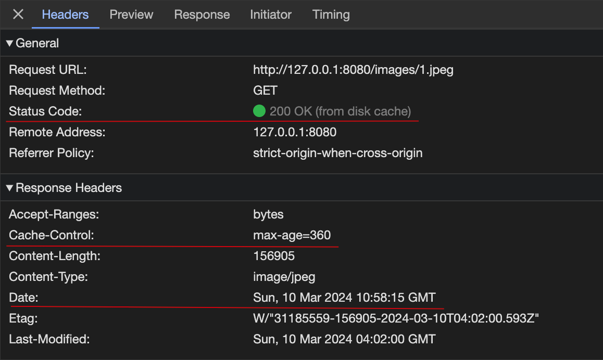
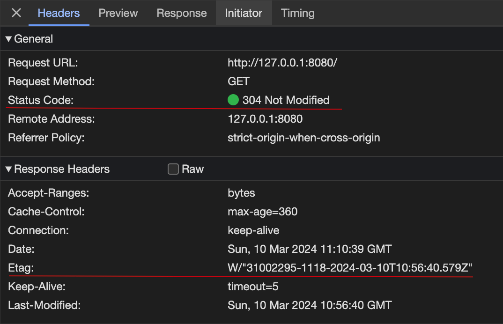
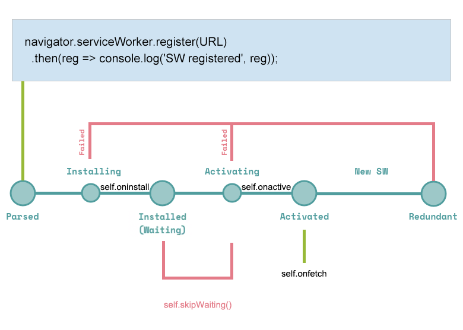

# Service Worker 入门与实践

网页的快速加载离不开前端缓存技术，前端缓存技术主要分为两种：HTTP 缓存和浏览器缓存。

## HTTP 缓存

HTTP 缓存分为两种类型：强缓存和协商缓存。

### 强缓存

当缓存的资源在有效期间内，不会向服务器发起任何请求，直接将缓存的资源当作响应返回。

具体示例：

Cache-Control - HTTP1.1 引入了 Cache-Control，它使用 max-age 指定资源被缓存多久；

例如：当值设为 max-age=360 时，则代表在这个请求正确返回后的 6 分钟内再次加载资源，会命中强缓存，直接使用本地的缓存资源。

<p align="center"></p>

### 协商缓存

每次都会向服务器发送请求，服务器会根据请求的 Request Headers 的一些参数来判断是否命中协商缓存；如果命中，则返回 304 状态码并带上新的 Response Headers 通知浏览器从本地缓存中读取资源；否则就使用响应的资源。

具体示例：

Etag - 资源的唯一标识符，可以是任意字符串。

例如：当服务器验证 Etag 值没有改变时，就会返回 304 告知浏览器继续使用本地缓存的资源。

<p align="center"></p>

## 浏览器缓存

简单的缓存方案方式有 cookie，localStorage 和 sessionStorage 等。

但这些方案都存在很多缺点：无法异步存储、存储空间有限、无法进行请求拦截、无法进行编程等。而 Service Worker 的出现正好填补了这些方案的缺点。

## Service Worker

简单介绍 Service Worker ：页面与服务器之间的网络代理，独立于主线程的工作者线程；可以对请求进行拦截，然后根据逻辑判断，发起网络请求或使用本地缓存。

<p align="center"></p>

### 成熟度

Service Worker 是 Chrome 团队提出和力推的一个 WEB API，该 WEB API 标准起草于 2013 年，于 2014 年纳入 W3C WEB 标准草案。

使用 Service Worker 技术的网站：okx、youtube、twitter、网易新闻等。

总体来说 Service Worker 还是比较成熟和可靠的。

### 注册 Service Worker

使用 Service Worker 之前必须要注册，使用 `navigator.serviceWorker.register` 方法进行注册：

```js
if ('serviceWorker' in navigator) {
  window.addEventListener('load', () => {
    navigator.serviceWorker.register('./serviceWorker.js')
  })
}
```

`navigator.serviceWorker.register(URL, { scope? }?);`

- scope - 配置 ServiceWorker 作用的路径（需要以 “/” 结尾）。

默认情况下，ServiceWorker 的作用范围为 URL 的同级路径以及子路径，例如："./serviceWorker.js"，作用于路径"./"以及子路径的所有页面。

可以通过配置 scope 参数收窄 serviceWorker 的作用路径，例如："./serviceWorker.js"，作用于路径"./"以及子路径的所有页面；可以通过配置 { scope: './article/' } ，让 ServiceWorker 只作用于页面路径为 /article/ 以及子路径的页面。

```js
if ('serviceWorker' in navigator) {
  window.addEventListener('load', () => {
    navigator.serviceWorker.register('./serviceWorker.js', {
      scope: './article/'
    })
  })
}
```

> 为了避免影响**页面的初次加载**，从而降低用户的体验，需要在 **window.onload** 事件中注册 serviceWorker 。

### ServiceWorkerRegistration

**navigator.serviceWorker.register** 方法返回一个 promise 对象；当注册成功时，返回 ServiceWorkerRegistration 对象。

ServiceWorkerRegistration 对象有如下属性：

- installing

如果有，则返回状态为 installing 的 ServiceWorker 对象，否则为 null。

- waiting

如果有，则返回状态为 waiting 的 ServiceWorker 对象，否则为 null。

- active

如果有，则返回状态 activating 或 activated 的 ServiceWorker 对象，否则为 null。

> ServiceWorker 对象的生命周期，稍后会详细介绍。

### ServiceWorker

ServiceWorker 对象可以通过以下方式获取：

```js
ServiceWorker = ServiceWorkerContainer.controller
ServiceWorker = ServiceWorkerRegistration.active
```

具有如下属性和方法：

- state

表示 ServiceWorker 对象状态的字符串，状态的顺序为：parsed, installing, installed, activating, activated, redundant。

- onstatechange

当 ServiceWorker.state 变化时，会触发该回调函数。

```js
serviceWorker.onstatechange = () => {}
```

### ServiceWorkerGlobalScope

在 ServiceWorker 线程内部，全局上下文是 ServiceWorkerGlobalScope 的实例。

具有如下属性和方法：

- caches：返回服务工作者线程的 CacheStorage 对象。

- clients：返回服务工作者线程的 Clients 接口，用于访问底层 Client 对象。

  - claim()：强制性地设置当前服务工作者线程以控制其作用域中的所有客户端。
    - 可用于**不希望等待页面重新加载而让服务工作者线程开始管理页面**，例如：在网站首次注册 ServiceWorker 后，ServiceWorker 不能接管页面，可以执行 claim 方法，让 ServiceWorker 接管页面。

- registration：返回服务工作者线程的 ServiceWorkerRegistration 对象。

- skipWaiting()：**强制服务工作者线程进入 activating 状态**。

- fetch()：在服务工作者线程内发送常规网络请求；用于在服务工作者线程确定有必要发送实际网络请求(而不是返回缓存值)时。

### Service Worker 生命周期

6 种可能存在的状态依次为：已解析（parsed）、安装中 （installing）、已安装/等待中（installed/waiting）、激活中（activating）、已激活（activated）和已失效（redundant）。

<p align="center"></p>

#### parsed

刚创建的 service worker 线程实例会进入 parsed（已解析） 状态

浏览器获取脚本文件，然后执行一些初始化任务，服务工作者线程的生命周期就开始了。

(1) 确保服务脚本来自相同的源。

(2) 确保在安全上下文（https）中注册服务工作者线程。

(3) 确保服务脚本可以被浏览器 JavaScript 解释器成功解析而不会抛出任何错误。

(4) 捕获服务脚本的快照。下一次浏览器下载到服务脚本，会与这个快照对比差异，并据此决定是否应该更新服务工作者线程。

这些任务全部成功后，则 navigator.serviceWorker.register() 返回的 promise 将会被解决为一个 ServiceWorkerRegistration 对象。

在此之后，新创建的服务工作者线程实例将会进入到 installing（安装中） 状态。

#### installing

在 installing 状态，需要进行**服务工作者线程控制页面前必须完成的操作**。

例如：添加新版本的缓存资源。

> 服务工作者线程在成功缓存指定资源之前可以一直处于该状态。如果任何资源缓存失败，服务工作者线程都会安装失败并跳至 redundant（已失效） 状态。

```js
const CACHE_KEY = "v1";

self.addEventListener("install", (event) => {
  event.waitUntil(
    caches
      .open(CACHE_KEY)
      .then((cache) => cache.addAll(["foo.js", "bar.html", "baz.css"]))
  );
};
```

#### installed

如果 service worker 安装完成，则状态将会变为 installed/waiting（已安装/等待中）意思是：服务工作者线程此时没有别的任务要做，只是准备在得到许可的时候去控制客户端。

- 一般情况下，当原有的 Service Worker 任然有效时，则新 Service Worker 需要处于 installed 状态，等待原有的 Service Worker 没有控制的客户端。

- 也可以通过 self.skipWaiting() 强制推进服务工作者线程的状态，进入 activating 状态。

#### activating

在如下几个场景下，一个处于 installed 状态的 Service Worker 会被触发，成为 activating 状态：

- 没有 Service Worker 被激活。

- 原有 Service Worker 控制的客户端数量变为 0。这通常意味着所有受控的浏览器标签页都被关闭；在下一个导航事件时，新 Service Worker 会到达 activating 状态。

- 已安装的 Service Worker 调用 self.skipWaiting()。这样可以立即生效，而不必等待一次导航事件。

activating（激活中）状态表示：**服务工作者线程已经被浏览器选中即将变成可以控制页面的服务工作者线程**。

1. 可以在此状态中，清除上一个版本 service worker 的缓存。

```js
self.addEventListener("activate", (event) => {
  event.waitUntil(
    caches.keys().then((cacheNames) => {
      return Promise.all(
        cacheNames
          .filter((cacheName) => return cacheName != currentCacheName)
          .map((cacheName) => return caches.delete(cacheName))
      );
    })
  );
});
```

2. 在网站第一次安装 Service Worker 时，强制 Service Worker 接管客户端，无需等待刷新页面。

```js
self.addEventListener('activate', (event) => {
  event.waitUntil(clients.claim())
})
```

#### activated

activated（已激活） 状态表示：服务工作者线程正在控制一个或多个客户端。

在这个状态，服务工作者线程会捕获其作用域中的 fetch()事件、通知和推送事件。

```js
self.addEventListener('fetch', (event) => {
  // Do stuff with fetch events
})
```

#### redundant

redundant（已失效） 状态表示服务工作者线程已被宣布死亡。不会再有事件发送给它，浏览器随时可能销毁它并回收它的资源。

当 service worker 状态变为 redundant ，有如下原因：

- 处于 installing 状态时安装失败
- 处于 activating 状态时激活失败
- 一个新的 Service Worker 代替了它称为了激活的 Service Worker

#### 实际场景 - 网站第一次安装 Service Worker

当页面上第一次调用 register() 注册 Service Worker 时，会被安装，但不接管页面；在刷新页面之后才会接管页面。

<p align="center"></p>

可以借助于 claim 方法，在网站第一次安装 Service Worker 时，立即接管页面，无需等待页面的刷新。

```js
self.addEventListener('activate', (event) => {
  event.waitUntil(self.clients.claim())
})
```

#### 实际场景 - 更新 Service Worker

如果发生一下任一情况，就会触发 Service Worker 的更新：

- 当 navigator.serviceWorker.register(URL) 中的 URL 不一样时。
- 浏览器导航到服务工作者线程作用域中的一个页面。
- 发生了 fetch()或 push()等功能性事件，且至少 24 小时内没有发生更新检查。
- 同样的 Service Worker 脚本文件 URL，但文件内容已经发生改变。

新的 Service Worker 安装成功后，将一直处于 waiting 状态，直到现有的 Service Worker 接管 0 个客户端。这是浏览器确保每次只运行一个 Service Worker 版本的方式。

<p align="center"></p>

可以借助于 skipWaiting 方法，新 Service Worker 在 waiting 状态下，让现有 Service Worker 立即失效，让新 Service Worker 进入 activating 状态，从而接管页面。

```js
self.addEventListener('install', (event) => {
  event.waitUntil(self.skitWaiting())
})
```

手动更新 Service Worker：

```js
ServiceWorkerRegistration.update()
```

> 更新 Service Worker 脚本文件时，默认不受 HTTP 缓存策略的影响；也就是说，每次都能请求服务器中最新的资源。

### Service Worker navigation preload

当网站注册了 Service Worker 后，则影响网页的渲染流程：

- 请求网页的 HTML 时，会**启动服务工作者线程**执行 Service Worker 相关 JavaScript 代码。
- 当本地资源无法使用时，则 Service Worker 需要通过网络请求资源。

与无 Service Worker 场景相比，多了一个"启动服务工作者线程"的过程。这个启动的时间取决于设备，通常为 50 毫秒左右。在移动设备上，可能是 250 毫秒。在极端情况（设备运行缓慢、CPU 遇到困难）下，可能会超过 500 毫秒。

<p align="center"></p>

开启 Service Worker 预加载：不论 ServiceWorker 是否使用本地资源的缓存，都发起网络请求资源；当 ServiceWorker 需要发起网络请求时，则直接使用之前已经预先发起的网络请求。

<p align="center"></p>

将串联的流程改为并联的流程，优化了：因"启动服务工作者线程"的耗时，对整个导航速度的影响。

<p align="center"></p>

具体代码：

```js
self.addEventListener("activate", (event) => {
  event.waitUntil(
    await self.registration.navigationPreload.enable();
  );
});
```

### CacheStorage

Cache Storage 是浏览器提供的一种 Web API，用于在客户端缓存中存储和管理资源。它是一种键值对存储系统，用于将请求的响应、文件、数据等保存在浏览器的缓存中，以便在后续的请求中可以直接从缓存中获取，提供更快的访问速度和离线使用能力。

- 开启一个 Cache 对象

```js
caches.open(cacheName).then((cache) => {
  // Do something with your cache
})
```

- 添加新的缓存资源

```js
cache.put(request, response).then(() => {
  // request/response pair has been added to the cache
})
```

- 删除缓存资源

```js
cache.delete(request).then(() => {
  //your cache entry has been deleted
})
```

- 查询是否对应的缓存资源

```js
caches.match(request, options).then((response) => {
  // Do something with the response
})
```

- 查询 CacheStorage 可用存储空间

```js
navigator.storage.estimate().then((estimate) => {
  estimate.usage // 已用空间
  estimate.quota // 总量空间
})
```

### 最佳实践

MDN：

```js
const addResourcesToCache = async (resources) => {
  const cache = await caches.open('v1')
  await cache.addAll(resources)
}

const putInCache = async (request, response) => {
  const cache = await caches.open('v1')
  await cache.put(request, response)
}

const cacheFirst = async ({ request, preloadResponsePromise, fallbackUrl }) => {
  // First try to get the resource from the cache
  const responseFromCache = await caches.match(request)
  if (responseFromCache) {
    return responseFromCache
  }

  // Next try to use (and cache) the preloaded response, if it's there
  const preloadResponse = await preloadResponsePromise
  if (preloadResponse) {
    console.info('using preload response', preloadResponse)
    putInCache(request, preloadResponse.clone())
    return preloadResponse
  }

  // Next try to get the resource from the network
  try {
    const responseFromNetwork = await fetch(request)
    // response may be used only once
    // we need to save clone to put one copy in cache
    // and serve second one
    putInCache(request, responseFromNetwork.clone())
    return responseFromNetwork
  } catch (error) {
    const fallbackResponse = await caches.match(fallbackUrl)
    if (fallbackResponse) {
      return fallbackResponse
    }
    // when even the fallback response is not available,
    // there is nothing we can do, but we must always
    // return a Response object
    return new Response('Network error happened', {
      status: 408,
      headers: { 'Content-Type': 'text/plain' }
    })
  }
}

// Enable navigation preload
const enableNavigationPreload = async () => {
  if (self.registration.navigationPreload) {
    await self.registration.navigationPreload.enable()
  }
}

self.addEventListener('activate', (event) => {
  event.waitUntil(enableNavigationPreload())
})

self.addEventListener('install', (event) => {
  event.waitUntil(
    addResourcesToCache([
      '/',
      '/index.html',
      '/style.css',
      '/app.js',
      '/image-list.js',
      '/star-wars-logo.jpg',
      '/gallery/bountyHunters.jpg',
      '/gallery/myLittleVader.jpg',
      '/gallery/snowTroopers.jpg'
    ])
  )
})

self.addEventListener('fetch', (event) => {
  event.respondWith(
    cacheFirst({
      request: event.request,
      preloadResponsePromise: event.preloadResponse,
      fallbackUrl: '/gallery/myLittleVader.jpg'
    })
  )
})
```

网易新闻：

```js
//需要缓存的资源列表
var precacheConfig = [
  [
    'https://static.ws.126.net/163/wap/f2e/milk_index/bg_img_sm_minfy.png',
    'c4f55f5a9784ed2093009dadf1e954f9'
  ],
  [
    'https://static.ws.126.net/163/wap/f2e/milk_index/change.png',
    '9af1b102ef784b8ff08567ba25f31d95'
  ],
  [
    'https://static.ws.126.net/163/wap/f2e/milk_index/icon-download.png',
    '1c02c724381d77a1a19ca18925e9b30c'
  ],
  [
    'https://static.ws.126.net/163/wap/f2e/milk_index/icon-login-dark.png',
    'b59ba5abe97ff29855dfa4bd3a7a9f35'
  ],
  [
    'https://static.ws.126.net/163/wap/f2e/milk_index/icon-refresh.png',
    'a5b1084e41939885969a13f8dbc88abd'
  ],
  [
    'https://static.ws.126.net/163/wap/f2e/milk_index/icon-video-play.png',
    '065ff496d7d36345196d254aff027240'
  ],
  [
    'https://static.ws.126.net/163/wap/f2e/milk_index/icon.ico',
    'a14e5365cc2b27ec57e1ab7866c6a228'
  ],
  [
    'https://static.ws.126.net/163/wap/f2e/milk_index/iconfont_1.eot',
    'e4d2788fef09eb0630d66cc7e6b1ab79'
  ],
  [
    'https://static.ws.126.net/163/wap/f2e/milk_index/iconfont_1.svg',
    'd9e57c341608fddd7c140570167bdabb'
  ],
  [
    'https://static.ws.126.net/163/wap/f2e/milk_index/iconfont_1.ttf',
    'f422407038a3180bb3ce941a4a52bfa2'
  ],
  [
    'https://static.ws.126.net/163/wap/f2e/milk_index/iconfont_1.woff',
    'ead2bef59378b00425779c4ca558d9bd'
  ],
  [
    'https://static.ws.126.net/163/wap/f2e/milk_index/index.5cdf03e8.js',
    '6262ac947d12a7b0baf32be79e273083'
  ],
  [
    'https://static.ws.126.net/163/wap/f2e/milk_index/index.bc729f8a.css',
    '58e54a2c735f72a24715af7dab757739'
  ],
  [
    'https://static.ws.126.net/163/wap/f2e/milk_index/logo-app-bohe.png',
    'ac5116d8f5fcb3e7c49e962c54ff9766'
  ],
  [
    'https://static.ws.126.net/163/wap/f2e/milk_index/logo-app-mail.png',
    'a12bbfaeee7fbf025d5ee85634fca1eb'
  ],
  [
    'https://static.ws.126.net/163/wap/f2e/milk_index/logo-app-manhua.png',
    'b8905b119cf19a43caa2d8a0120bdd06'
  ],
  [
    'https://static.ws.126.net/163/wap/f2e/milk_index/logo-app-open.png',
    'b7cc76ba7874b2132f407049d3e4e6e6'
  ],
  [
    'https://static.ws.126.net/163/wap/f2e/milk_index/logo-app-read.png',
    'e6e9c8bc72f857960822df13141cbbfd'
  ],
  [
    'https://static.ws.126.net/163/wap/f2e/milk_index/logo-site.png',
    '2b0d728b46518870a7e2fe424e9c0085'
  ],
  [
    'https://static.ws.126.net/163/wap/f2e/milk_index/version_no_pic.png',
    'aef80885188e9d763282735e53b25c0e'
  ],
  [
    'https://static.ws.126.net/163/wap/f2e/milk_index/version_pc.png',
    '42f3cc914eab7be4258fac3a4889d41d'
  ],
  [
    'https://static.ws.126.net/163/wap/f2e/milk_index/version_standard.png',
    '573408fa002e58c347041e9f41a5cd0d'
  ]
]
var cacheName =
  'sw-precache-v3-new-wap-index-' +
  (self.registration ? self.registration.scope : '')

var ignoreUrlParametersMatching = [/^utm_/]

var addDirectoryIndex = function (originalUrl, index) {
  var url = new URL(originalUrl)
  if (url.pathname.slice(-1) === '/') {
    url.pathname += index
  }
  return url.toString()
}
var cleanResponse = function (originalResponse) {
  // If this is not a redirected response, then we don't have to do anything.
  if (!originalResponse.redirected) {
    return Promise.resolve(originalResponse)
  }
  // Firefox 50 and below doesn't support the Response.body stream, so we may
  // need to read the entire body to memory as a Blob.
  var bodyPromise =
    'body' in originalResponse
      ? Promise.resolve(originalResponse.body)
      : originalResponse.blob()
  return bodyPromise.then(function (body) {
    // new Response() is happy when passed either a stream or a Blob.
    return new Response(body, {
      headers: originalResponse.headers,
      status: originalResponse.status,
      statusText: originalResponse.statusText
    })
  })
}
var createCacheKey = function (
  originalUrl,
  paramName,
  paramValue,
  dontCacheBustUrlsMatching
) {
  // Create a new URL object to avoid modifying originalUrl.
  var url = new URL(originalUrl)
  // If dontCacheBustUrlsMatching is not set, or if we don't have a match,
  // then add in the extra cache-busting URL parameter.
  if (
    !dontCacheBustUrlsMatching ||
    !url.pathname.match(dontCacheBustUrlsMatching)
  ) {
    url.search +=
      (url.search ? '&' : '') +
      encodeURIComponent(paramName) +
      '=' +
      encodeURIComponent(paramValue)
  }
  return url.toString()
}
var isPathWhitelisted = function (whitelist, absoluteUrlString) {
  // If the whitelist is empty, then consider all URLs to be whitelisted.
  if (whitelist.length === 0) {
    return true
  }
  // Otherwise compare each path regex to the path of the URL passed in.
  var path = new URL(absoluteUrlString).pathname
  return whitelist.some(function (whitelistedPathRegex) {
    return path.match(whitelistedPathRegex)
  })
}
var stripIgnoredUrlParameters = function (
  originalUrl,
  ignoreUrlParametersMatching
) {
  var url = new URL(originalUrl)
  // Remove the hash; see https://github.com/GoogleChrome/sw-precache/issues/290
  url.hash = ''
  url.search = url.search
    .slice(1) // Exclude initial '?'
    .split('&') // Split into an array of 'key=value' strings
    .map(function (kv) {
      return kv.split('=') // Split each 'key=value' string into a [key, value] array
    })
    .filter(function (kv) {
      return ignoreUrlParametersMatching.every(function (ignoredRegex) {
        return !ignoredRegex.test(kv[0]) // Return true iff the key doesn't match any of the regexes.
      })
    })
    .map(function (kv) {
      return kv.join('=') // Join each [key, value] array into a 'key=value' string
    })
    .join('&') // Join the array of 'key=value' strings into a string with '&' in between each
  return url.toString()
}

var hashParamName = '_sw-precache'
//定义需要缓存的url列表
var urlsToCacheKeys = new Map(
  precacheConfig.map(function (item) {
    var relativeUrl = item[0]
    var hash = item[1]
    var absoluteUrl = new URL(relativeUrl, self.location)
    var cacheKey = createCacheKey(absoluteUrl, hashParamName, hash, false)
    return [absoluteUrl.toString(), cacheKey]
  })
)
//把cache中的url提取出来,进行去重操作
function setOfCachedUrls(cache) {
  return cache
    .keys()
    .then(function (requests) {
      //提取url
      return requests.map(function (request) {
        return request.url
      })
    })
    .then(function (urls) {
      //去重
      return new Set(urls)
    })
}
//sw安装阶段
self.addEventListener('install', function (event) {
  event.waitUntil(
    //首先尝试取出存在客户端cache中的数据
    caches
      .open(cacheName)
      .then(function (cache) {
        return setOfCachedUrls(cache).then(function (cachedUrls) {
          return Promise.all(
            Array.from(urlsToCacheKeys.values()).map(function (cacheKey) {
              //如果需要缓存的url不在当前cache中,则添加到cache
              if (!cachedUrls.has(cacheKey)) {
                //设置same-origin是为了兼容旧版本safari中其默认值不为same-origin,
                //只有当URL与响应脚本同源才发送 cookies、 HTTP Basic authentication 等验证信息
                var request = new Request(cacheKey, {
                  credentials: 'same-origin'
                })
                return fetch(request).then(function (response) {
                  //通过fetch api请求资源
                  if (!response.ok) {
                    throw new Error(
                      'Request for ' +
                        cacheKey +
                        ' returned a ' +
                        'response with status ' +
                        response.status
                    )
                  }
                  return cleanResponse(response).then(function (
                    responseToCache
                  ) {
                    //并设置到当前cache中
                    return cache.put(cacheKey, responseToCache)
                  })
                })
              }
            })
          )
        })
      })
      .then(function () {
        //强制跳过等待阶段,进入激活阶段
        return self.skipWaiting()
      })
  )
})
self.addEventListener('activate', function (event) {
  //清除cache中原来老的一批相同key的数据
  var setOfExpectedUrls = new Set(urlsToCacheKeys.values())
  event.waitUntil(
    caches
      .open(cacheName)
      .then(function (cache) {
        return cache.keys().then(function (existingRequests) {
          return Promise.all(
            existingRequests.map(function (existingRequest) {
              if (!setOfExpectedUrls.has(existingRequest.url)) {
                //cache中删除指定对象
                return cache.delete(existingRequest)
              }
            })
          )
        })
      })
      .then(function () {
        //self相当于webworker线程的当前作用域
        //当一个 service worker 被初始注册时，页面在下次加载之前不会使用它。claim() 方法会立即控制这些页面
        //从而更新客户端上的serviceworker
        return self.clients.claim()
      })
  )
})

self.addEventListener('fetch', function (event) {
  if (event.request.method === 'GET') {
    // 标识位,用来判断是否需要缓存
    var shouldRespond
    // 对url进行一些处理,移除一些不必要的参数
    var url = stripIgnoredUrlParameters(
      event.request.url,
      ignoreUrlParametersMatching
    )
    // 如果该url不是我们想要缓存的url,置为false
    shouldRespond = urlsToCacheKeys.has(url)
    // 如果shouldRespond未false,再次验证
    var directoryIndex = 'index.html'
    if (!shouldRespond && directoryIndex) {
      url = addDirectoryIndex(url, directoryIndex)
      shouldRespond = urlsToCacheKeys.has(url)
    }
    // 再次验证,判断其是否是一个navigation类型的请求
    var navigateFallback = ''
    if (
      !shouldRespond &&
      navigateFallback &&
      event.request.mode === 'navigate' &&
      isPathWhitelisted([], event.request.url)
    ) {
      url = new URL(navigateFallback, self.location).toString()
      shouldRespond = urlsToCacheKeys.has(url)
    }
    // 如果标识位为true
    if (shouldRespond) {
      event.respondWith(
        caches
          .open(cacheName)
          .then(function (cache) {
            //去缓存cache中找对应的url的值
            return cache
              .match(urlsToCacheKeys.get(url))
              .then(function (response) {
                //如果找到了,就返回value
                if (response) {
                  return response
                }
                throw Error('The cached response that was expected is missing.')
              })
          })
          .catch(function (e) {
            // 如果没找到则请求该资源
            console.warn(
              'Couldn\'t serve response for "%s" from cache: %O',
              event.request.url,
              e
            )
            return fetch(event.request)
          })
      )
    }
  }
})
```

## 总结

本文只是简单地总结了 Service Worker 的基本使用，以及使用 Service Worker 做客户端缓存的简单方式。利用 Service Worker 可以对网站进行全面而细致的缓存配置。

然而，Service Worker 的作用远不止于此，例如：

- 后台数据同步
- 响应来自其它源的资源请求，
- 集中接收计算成本高的数据更新，比如地理位置和陀螺仪信息，这样多个页面就可以利用同一组数据
- 在客户端进行 CoffeeScript，LESS，CJS/AMD 等模块编译和依赖管理（用于开发目的）
- 后台服务钩子
- 自定义模板用于特定 URL 模式
- 性能增强，比如预取用户可能需要的资源，比如相册中的后面数张图片

希望大家能发挥想象力，用好这个服务工作者线程。

## 参考

- [The service worker lifecycle](https://web.dev/articles/service-worker-lifecycle)

- [Using Service Workers](https://developer.mozilla.org/en-US/docs/Web/API/Service_Worker_API/Using_Service_Workers)

- [网易云课堂 Service Worker 运用与实践](https://mp.weixin.qq.com/s/3Ep5pJULvP7WHJvVJNDV-g)

- [Speed up service worker with navigation preloads](https://web.dev/blog/navigation-preload)
