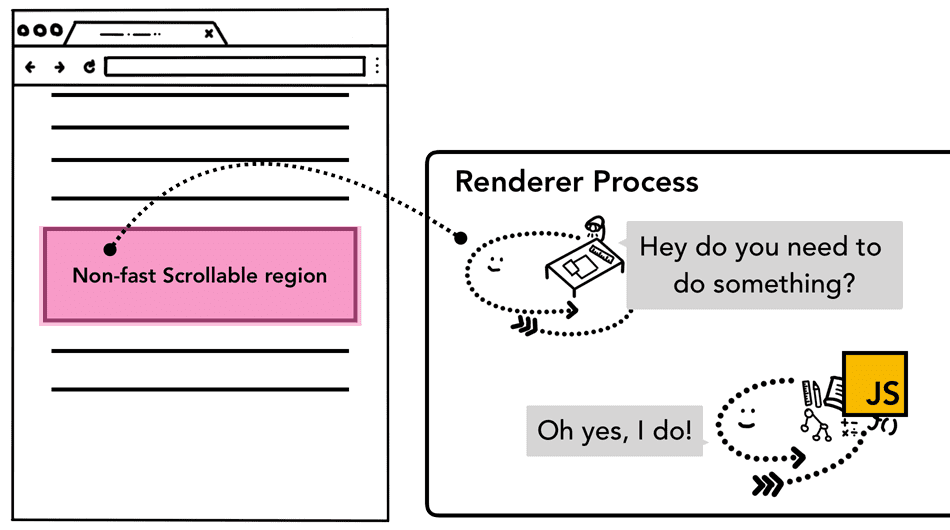

# addEventListener 中 passive 的作用

## 背景：event.preventDefault

在 JavaScript 中，有许多事件会自动地触发浏览器的某些行为，例如：

- 点击 a 标签——导航到 href 指定的 URL。
- 点击 form 表单的提交按钮——将表单数据提交到服务器，自动跳转到其他页面。
- 在 input 输入框中，按下键盘某个字母——将该字母输入到输入框里。

在事件的回调函数中，可以通过执行`event.preventDefault`方法取消对应的浏览器默认行为，以便实现更加灵活的用户交互。

## 背景：页面滑动

页面的上下滑动是一个经常发生的用户交互场景，这个场景不需要`渲染进程`的`主线程`（页面渲染、JavaScript 执行）的参与，直接由`合成线程`完成。因此，`主线程`的任务阻塞，不会影响页面上下丝滑般的滑动。

### 仅通过 scroll 事件，无法阻止页面滑动

因为页面滑动事件发生后，才会触发 scroll 事件的回调函数；所以在 scroll 事件的回调函数里，通过调用`event.preventDefault`方法，无法阻止页面的滑动。

```js
document.addEventListener('scroll', (event) => {
  event.preventDefault(); // Can't stop the page from scrolling
});
```

### 多个事件的默认行为，都可以导致页面滑动

- 鼠标滚动（wheel）
- 键盘上下键（keydown）
- 拖动滚动条
- ......

在上面这些事件的回调函数里，调用`event.preventDefault`方法，可以阻止其默认行为（页面滑动）。

```js
document.addEventListener('wheel', (event) => {
  event.preventDefault(); // Can stop the page from scrolling
});
```

## 非快速滚动区域（non-fast scrollable region）

当一个页面被合成的时候，`合成线程`会将页面中那些注册了事件监听器的区域标记为“非快速滚动区域”（Non-fast Scrollable Region）。

- 事件发生在这些区域时，`合成线程`会将事件发送给`主线程`来处理，`主线程`调用相关事件的回调函数，会有如下情况：

  - `监听器函数`执行的时间过长，导致新的帧出现时间过晚，给用户卡顿的感觉。

  - 执行`event.preventDefault`函数，通知`合成线程`停止合成一个新的帧；页面也就没有滑动的效果。

- 事件发生在其他区域，`合成线程`就无须等待`主线程`的处理，直接合成一个新的帧，使页面产生滑动的效果。

<p align="center"></p>

## passive

```js
addEventListener(type, listener, { passive: boolean });
```

当事件注册时，其 passive 为 true 时，表明该事件的监听器（listener）为被动（passive）监听器。也就是说：监听器只是事件的接收者，无法对该事件所产生的浏览器默认行为产生任何影响。

例如：

```js
document.addEventListener('wheel', listener, { passive: true });
```

- 当页面滑动时
  - 一方面：滑动事件通知给`合成线程`，直接合成一个新的帧，使页面立即产生滑动的效果。
  - 同时，另一方面；滑动事件通知给`主线程`，调用`wheel`事件的监听器函数。

`合成线程`和`主线程`两者相互不干扰。

### 默认值

passive 默认值为`false`。

当 passive 为 `true` 时，执行`event.preventDefault`方法，除了在控制台打印一条错误日志外，无任何其他影响。

### 示例：`主线程`繁忙，但页面滑动丝滑

页面的滑动涉及`合成线程`，不涉及`主线程`；所以当`主线程`繁忙时，依然不影响页面滑动。

<p align="center"></p>

[动手试试看](https://codepen.io/steven_code/pen/KKjYQoZ)

```html
<!DOCTYPE html>
<html lang="en">
  <head>
    <meta charset="UTF-8" />
    <meta name="viewport" content="width=device-width, initial-scale=1.0" />
    <title>Document</title>
    <style>
      body {
        height: 3000px;
        background: linear-gradient(70deg, blue, pink);
      }
    </style>
  </head>

  <body>
    <script>
      setTimeout(() => {
        console.log('Main thread is very busy');

        while (true) {}
      }, 3 * 1000);
    </script>
  </body>
</html>
```

## 示例：wheel 事件的监听器影响了页面滑动

通过鼠标在页面滑动页面时，因为注册了 wheel 事件，所以页面的滑动需要依赖 wheel 监听器函数的执行。

wheel 监听器函数有 80%概率会卡顿 0.5s， 通过下面的动图可以看出来：页面在滑动过程中，不是那么丝滑，有明显的卡顿感觉。

<p align="center"></p>

[动手试试看](https://codepen.io/steven_code/pen/eYwoVLP)

```html
<!DOCTYPE html>
<html lang="en">
  <head>
    <meta charset="UTF-8" />
    <meta name="viewport" content="width=device-width, initial-scale=1.0" />
    <title>Document</title>
    <style>
      div {
        height: 3000px;
        background: linear-gradient(70deg, blue, pink);
      }
    </style>
  </head>

  <body>
    <div></div>

    <script>
      function jank(amt) {
        const start = Date.now();
        while (Date.now() < start + amt) {}
      }

      document.querySelector('div').addEventListener(
        'wheel',
        (e) => {
          if (Math.random() > 0.8) {
            console.log('jank start ---------');
            jank(500);
            console.log('jank end ---------');
            console.log('\n');
          }
        },
        { passive: !true },
      );
    </script>
  </body>
</html>
```

## 示例：passive true，避免了 wheel 事件的监听器影响页面滑动

passive - true，将页面的滑动和监听器函数的执行两者分开，互不干扰。

wheel 监听器函数有 80%概率会卡顿 0.5s；但通过下面的动图可以看出来：页面在滑动过程中，非常丝滑，没有明显的卡顿感觉。

<p align="center"></p>

[动手试试看](https://codepen.io/steven_code/pen/MWMRQzB)

```html
<!DOCTYPE html>
<html lang="en">
  <head>
    <meta charset="UTF-8" />
    <meta name="viewport" content="width=device-width, initial-scale=1.0" />
    <title>Document</title>
    <style>
      div {
        height: 3000px;
        background: linear-gradient(70deg, blue, pink);
      }
    </style>
  </head>

  <body>
    <div></div>

    <script>
      function jank(amt) {
        const start = Date.now();
        while (Date.now() < start + amt) {}
      }

      document.querySelector('div').addEventListener(
        'wheel',
        (e) => {
          if (Math.random() > 0.8) {
            console.log('jank start ---------');
            jank(500);
            console.log('jank end ---------');
            console.log('\n');
          }
        },
        { passive: true },
      );
    </script>
  </body>
</html>
```

## 总结

1. 在事件注册时，为其添加 passive-true 配置项。声明其监听器为被动（passive）监听器，不影响事件触发浏览器的默认行为（滑动页面时，`合成线程`不受`主线程`的影响）。

2. wheel 事件、touchmove 事件，有页面滚动的默认行为；可以通过执行`event.preventDefault`方法，来阻止 wheel、touchmove 事件，从而阻止页面的滚动。
