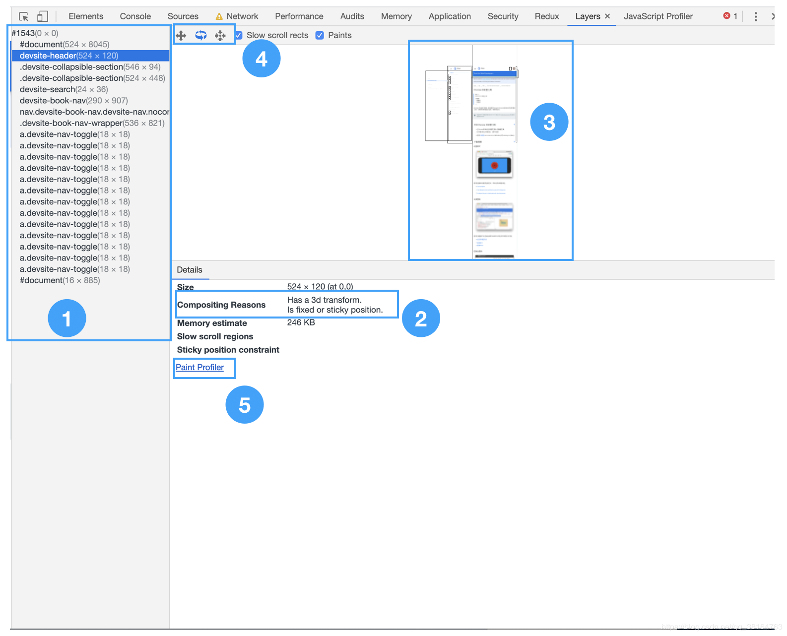
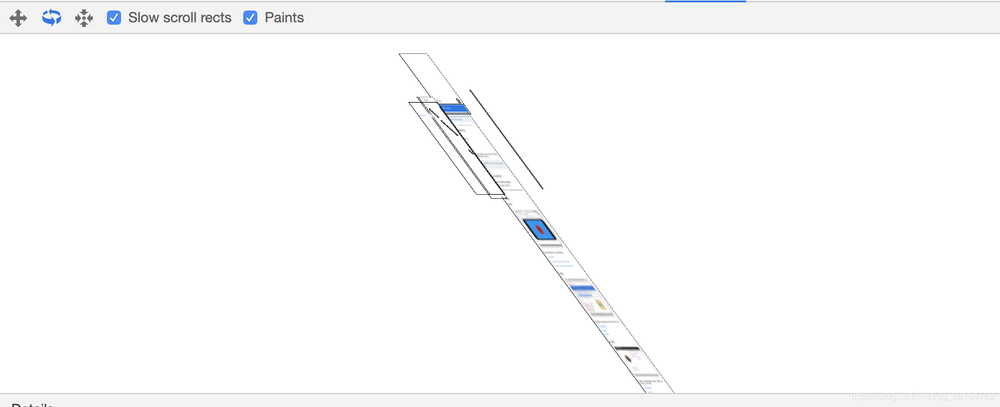
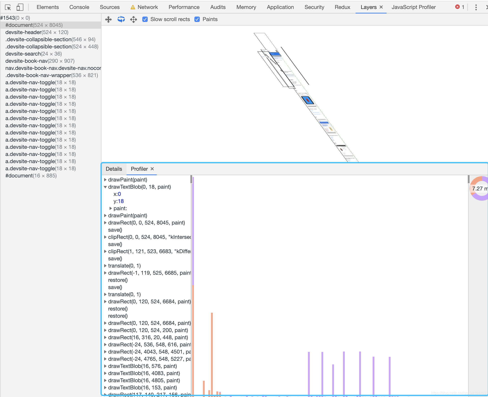

# Chrome DevTools —— Layers

`主线程（main thread）`利用布局树（Layout Tree），生成页面的图层树（Layer Tree）。

通过 Chrome DevTools Layers 面板，可以看到页面的图层。

## 面板功能介绍

1. 图层列表，包含了页面中所有的图层。

2. 图层生成的原因。

3. 页面的模型。

4. 操作区域，从左到右，依次是：
   - 平移模式
   - 旋转模式（3D旋转）
   - 重置（回到最初展示样式）
   - 是否展示“慢速滚动区域”（没有设置passive为true，导致页面滚动需要依赖`主线程`，页面滚动变得不流畅、卡顿）
   - 是否展示页面细节

> 在 macOS 中，`command + 鼠标滚动`，可以缩放页面模型。

5. 点击该按钮，可以展示该图层的渲染顺序和细节

## 页面模式，立体展示

## 某个图层的渲染顺序和细节

拖动左右两侧的滑块，可以重新该图层的绘制过程。

