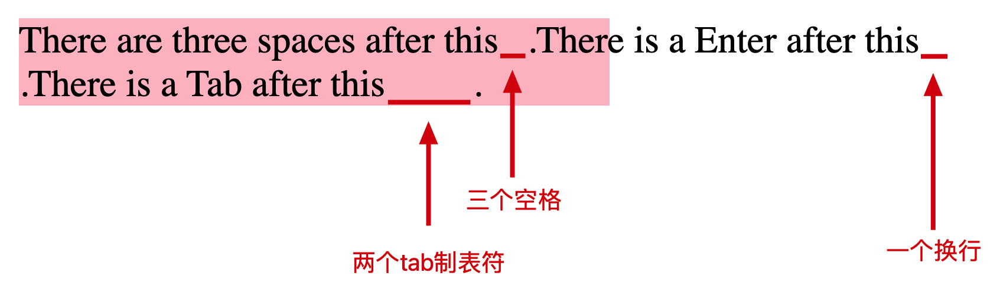
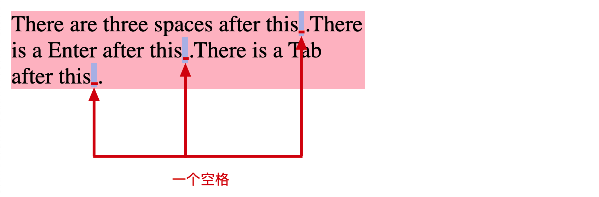
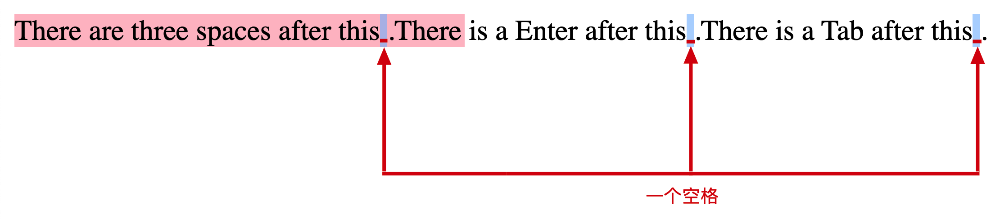
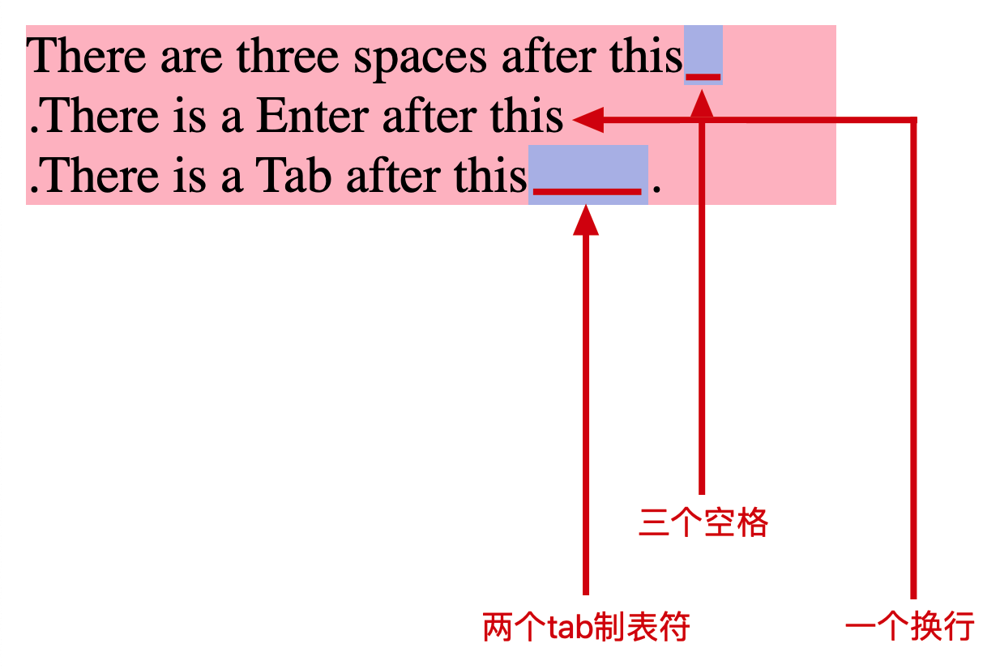
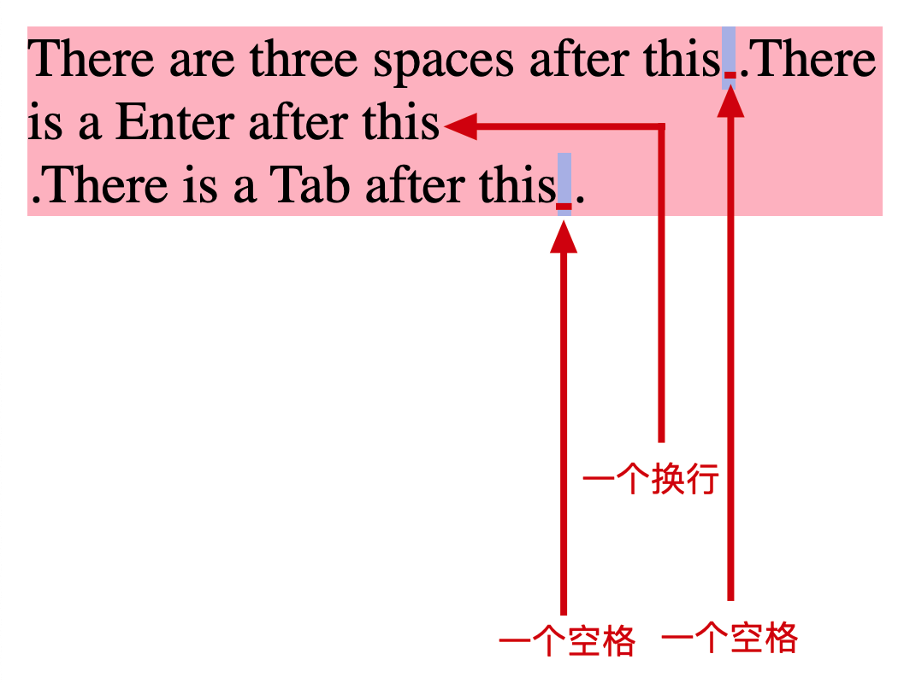

# css，white-space，用法简介

HTML 元素内的空白主要包含这三个：Space（空格）、Enter（回车）、Tab（制表符）。

这个属性指定了两件事：

- 空白字符是否合并？空白字符如何合并？

- 是否换行？如何换行？

在日常开发中，对于文字的空格和换行，默认的逻辑是：

- 每一处的空格、回车、制表符都合并成一个空格。

- 文字超过一行时，会自动换行。

带着默认的逻辑，一起来看看该属性的其他配置。

## normal（默认）

每一处的空格、回车、制表符都合并成一个空格，文本自动换行。

<p align="center"></p>
<h6 style="text-align:center;">prevent</h6>
<p align="center"></p>
<h6 style="text-align:center;">normal(default)</h6>

[动手试试看](https://codepen.io/steven_code/pen/ZEdNZqO)

<!-- prettier-ignore-start -->
```html
<!DOCTYPE html>
<html lang="en">
<head>
  <meta charset="UTF-8">
  <meta name="viewport" content="width=device-width, initial-scale=1.0">
  <title>Document</title>
</head>
<body>
	<div class="app">There are three spaces after this   .There is a Enter after this
.There is a Tab after this		.</div>
  <style>
    .app {
      width: 250px;
      white-space: normal;
      background: pink;
    }
  </style>
</body>
</html>
```
<!-- prettier-ignore-end -->

## nowrap

与 normal 的区别：文本不会自动换行。

每一处的空格、回车、制表符都合并成一个空格，文本不会自动换行。

<p align="left"></p>
<h6 style="text-align:center;">prevent</h6>
<p align="center"></p>
<h6 style="text-align:center;">nowrap</h6>

[动手试试看](https://codepen.io/steven_code/pen/YzobMJv)

<!-- prettier-ignore-start -->
```html
<!DOCTYPE html>
<html lang="en">
<head>
  <meta charset="UTF-8">
  <meta name="viewport" content="width=device-width, initial-scale=1.0">
  <title>Document</title>
</head>
<body>
	<div class="app">There are three spaces after this   .There is a Enter after this
.There is a Tab after this		.</div>
  <style>
    .app {
      width: 250px;
      white-space: nowrap;
      background: pink;
    }
  </style>
</body>
</html>
```
<!-- prettier-ignore-end -->

## pre

文本原样输出，文本不换行。

<p align="center"></p>
<h6 style="text-align:center;">prevent</h6>

[动手试试看](https://codepen.io/steven_code/pen/ZEdNZMO)

<!-- prettier-ignore-start -->
```html
<!DOCTYPE html>
<html lang="en">
<head>
  <meta charset="UTF-8">
  <meta name="viewport" content="width=device-width, initial-scale=1.0">
  <title>Document</title>
</head>
<body>
	<div class="app">There are three spaces after this   .There is a Enter after this
.There is a Tab after this		.</div>
  <style>
    .app {
      width: 250px;
      white-space: pre;
      background: pink;
    }
  </style>
</body>
</html>
```
<!-- prettier-ignore-end -->

## pre-wrap

与 pre 的区别：文本会自动换行。

文本原样输出，文本会自动换行。

[动手试试看](https://codepen.io/steven_code/pen/XWLwQyp)

<p align="left"></p>
<h6 style="text-align:center;">prevent</h6>
<p align="left"></p>
<h6 style="text-align:center;">pre-wrap</h6>

<!-- prettier-ignore-start -->
```html
<!DOCTYPE html>
<html lang="en">
<head>
  <meta charset="UTF-8">
  <meta name="viewport" content="width=device-width, initial-scale=1.0">
  <title>Document</title>
</head>
<body>
	<div class="app">There are three spaces after this   .There is a Enter after this
.There is a Tab after this		.</div>
  <style>
    .app {
      width: 250px;
      white-space: pre-wrap;
      background: pink;
    }
  </style>
</body>
</html>
```
<!-- prettier-ignore-end -->

## pre-line

每一处空格、制表符合并成一个空格，回车不变，文本自动换行。

[动手试试看](https://codepen.io/steven_code/pen/gONJyQZ)

<p align="left"></p>
<h6 style="text-align:center;">prevent</h6>
<p align="left"></p>
<h6 style="text-align:center;">pre-line</h6>

<!-- prettier-ignore-start -->
```html
<!DOCTYPE html>
<html lang="en">
<head>
  <meta charset="UTF-8">
  <meta name="viewport" content="width=device-width, initial-scale=1.0">
  <title>Document</title>
</head>
<body>
	<div class="app">There are three spaces after this   .There is a Enter after this
.There is a Tab after this		.</div>
  <style>
    .app {
      width: 250px;
      white-space: pre-line;
      background: pink;
    }
  </style>
</body>
</html>
```
<!-- prettier-ignore-end -->
