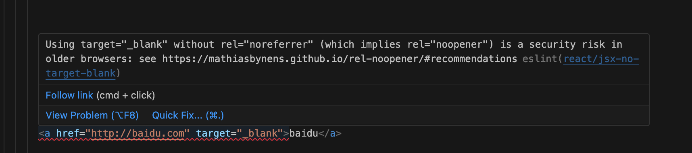
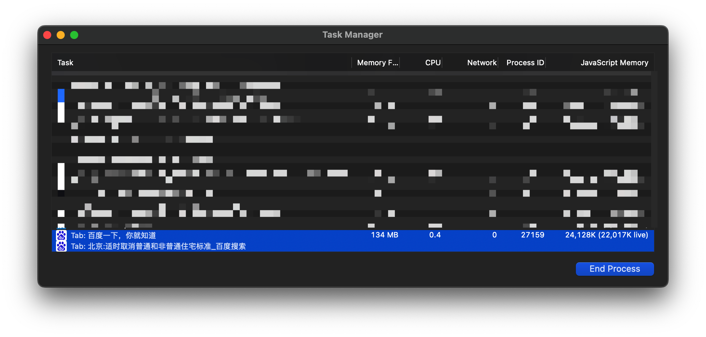

# react/jsx-no-target-blank 规则中关于 noreferrer noopener 的介绍

在最近的开发中，eslint 给 a 标签一个警告：

查看了一下规则的详情，发现该报错和 DOM 的 rel 属性 `noreferrer` 和 `noopener` 有关。

下面，先来介绍一下 `rel` 属性的各个属性值。

## rel - opener

对于 \<a>、\<area>、\<form> 元素的 rel 属性而言，`opener`属性值指示：从 A 页面打开 B 页面（新标签页中打开），B 页面可以通过`window.opener`访问 A 页面的`window`对象。

### 优点：节省内存

如果 A 页面和 B 页面是同一站点（协议、主域名、端口都相同）的关系，则这两个页面会在同一个渲染进程里，这样会比较节省内存。

例如：https://www.baidu.com 和 https://mbd.baidu.com/ 是同一站点；所以在www.baidu.com页面打开mbd.baidu.com页面，这两个页面会共享一个渲染进程。

### 缺点：不安全

B 页面可以访问 A 页面的`window`对象（**无跨域限制**）。

### window.opener

- 同域关系：B 页面拥有 A 页面 window 对象的所有权限。

- 跨域关系：B 页面拥有 A 页面 window 对象的部份权限。
  - self
  - location（调用 location.replace 方法；给 location.href 赋值，跳转其他 URL）
  - close
  - closed
  - focus
  - blur
  - frames
  - length
  - top
  - opener
  - parent
  - postMessage

> 两个页面属于跨域关系时，可以利用 window.opener 触发跳转页面的特性，实施网站钓鱼攻击：A 页面打开 B 页面，B 页面修改 A 页面的 URL，使其跳转到钓鱼网站，但用户不知道这一变化；当用户回到 A 页面时，再诱导用户在钓鱼网站上输入账号信息，从而获取这些重要信息。

## rel - noopener

`noopener`与`opener`是相反：B 页面无法访问 A 页面的`window`对象，window.opener 返回 null。

> 对于 \<a>、\<area>、\<form> 元素的 rel 属性而言，`现代浏览器（Chrome ≥ 88, Edge ≥ 88, Firefox ≥ 79 and Safari ≥ 12.2）`隐含地实现了`noopener"`属性值。

### 兼容性

实现了`rel="noopener"`的浏览器版本号：

- Chrome >= 49
- Opera >= 36
- Firefox >= 52
- desktop Safari >= 10.1
- iOS Safari >= 10.3

## rel - noreferrer

对于 \<a>、\<area>、\<form> 元素的 rel 属性而言，`noreferrer` 关键字指示浏览器在导航到目标 URL 时，忽略 Referer 请求头字段。

> ！！当使用`rel="noreferrer"`时，会实现`noopener`的所有功能。

> Referer 请求头可以标识页面流量是`直接流量`还是`引流流量（从A页面引过来的流量）`.

## window.open

除了通过 a 标签打开一个新标签页面外，`window.open`也是打开新标签页面的一个常用方式。其语法如下所示：

`window.open(url, target, windowFeatures)`

可以为`windowFeatures`添加相关配置项，来达到和 a 标签 rel 属性 一致的效果：

- `window.open(url, target, 'noopener')`：B 页面无法访问 A 页面的 window 对象（A 页面打开 B 页面）。

- `window.open(url, target, 'noreferrer')`：B 页面无法访问其 referrer 信息。

- `window.open(url, target, 'noopener,noreferrer')`：B 页面无法访问 A 页面的 window 对象（A 页面打开 B 页面），且 B 页面无法访问其 referrer 信息。

默认情况下，`windowFeatures`为""（空字符串），既表示：'opener,referrer'（可以访问 A 页面 window 对象 & 可以访问其 referrer 信息）

## 从全局的角度控制 window 的泄漏：Cross-Origin-Opener-Policy

HTTP 的响应头 - Cross-Origin-Opener-Policy 可以控制顶级文档不与其他跨域文档共享**浏览上下文组**。当顶级文档的 Cross-Origin-Opener-Policy 设置为以下值时：

- 不设置（同 unsafe-none）

- unsafe-none

  - Cross-Origin-Opener-Policy 的默认值
  - 当跨域文档的`Cross-Origin-Opener-Policy` 为`unsafe-none`或未设置时，可以访问 window.opener
  - 其他情况，无法访问 window.opener

- same-origin-allow-popups

  - 当跨域文档的`Cross-Origin-Opener-Policy` 为`unsafe-none`或未设置时，可以访问 window.opener
  - 其他情况，无法访问 window.opener

- same-origin
  - 跨域文档无法访问 window.opener

### 浏览上下文组（browsing context group）

在 WhatWG 规范中，把这一类具有相互连接关系的标签页称为：浏览上下文组（browsing context group）。

> 一个标签页所包含的内容，诸如 window 对象，历史记录，滚动条位置等信息称为浏览上下文。通过脚本相互连接起来的浏览上下文就是浏览上下文组。

## 实战

为了避免网站被钓鱼攻击，造成用户账号被盗，需要对`window.opener`信息进行隔离。

### 避免影响 `Referer`

为了避免对**网页统计分析等业务**造成影响，不能一刀切地使用`noreferrer`来阻止`Referer`的泄漏。

### 阻止`window.opener`信息的泄漏

首先从全局角度出发，利用响应头字段`Cross-Origin-Opener-Policy`，隔绝`window.opener`信息的泄漏：

`cross-origin-opener-policy: same-origin`

但是支持`Cross-Origin-Opener-Policy`的浏览器不是很多（[最早也需要 2020-05-19 之后发布的浏览器](https://developer.mozilla.org/en-US/docs/Web/HTTP/Headers/Cross-Origin-Opener-Policy#browser_compatibility)），其全球市场占用率为[92.25 %（11/4/2024）](https://caniuse.com/?search=Cross-Origin-Opener-Policy)。

而支持`rel - noopener`的浏览器要[早很多 - 2016-03-02 之后发布的浏览器](https://developer.mozilla.org/en-US/docs/Web/HTML/Attributes/rel/noopener#html.elements.area.rel.noopener)，其市场占用率为[97.62%（11/4/2024）](https://caniuse.com/?search=rel%3Dnoopener%20)。

`<a target="_blank" href="link" rel="noopener">link</a>`

`window.open(link, '_blank', 'noopener')`

### 总结

先从全局角度设置，阻止跨域页面访问`window.opener`对象：`cross-origin-opener-policy: same-origin`

再从局部角度设置，尽可能地提高浏览器覆盖率：

`<a target="_blank" href="link" rel="noopener">link</a>`

`window.open(link, '_blank', 'noopener')`

## 总结

从全局角度来看，可以利用`Cross-Origin-Opener-Policy`控制 window 的泄漏。

从局部角度来看，可以为 a 标签和 window.open 方法，添加`noopener`和`noreferrer`两个标识符，控制 window 和 referrer 的泄漏。
