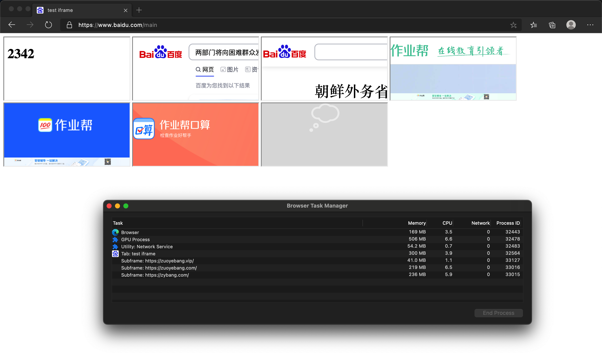
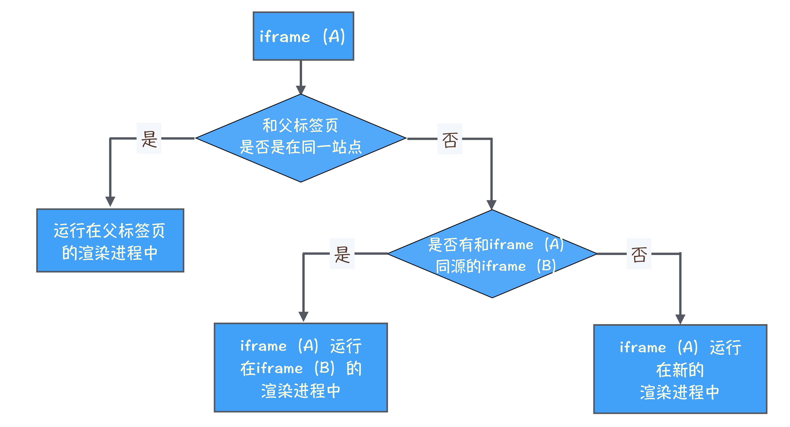
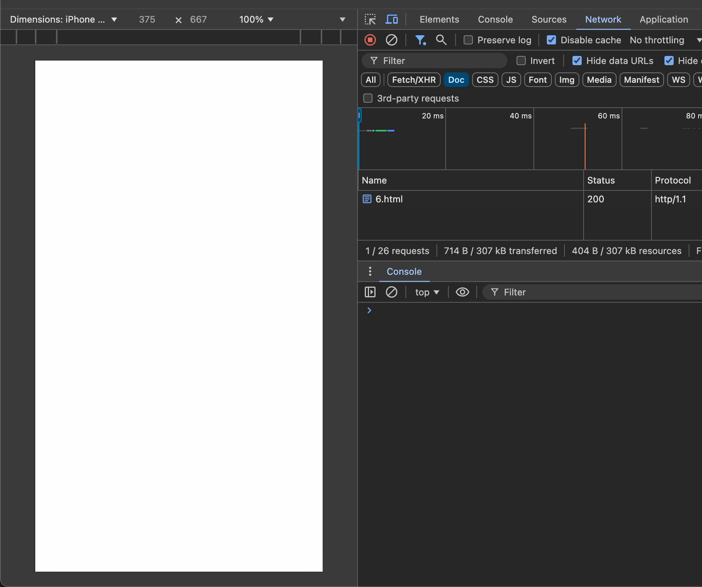

# 微前端的靠谱实现方案 —— iframe

一年多之前，为了能在老旧的 Vue 项目中开发 React 页面，特地调研了一些主流的`微前端`框架：qiankun、无界等等。但都发现其实现的方案无法摆脱 JavaScript 的限制，不是 100%的将多个框架分离开，实施过程中，坑太多。于是采用了`iframe`这个天然的沙箱，将多个框架 100%分离开。从现在的角度来看，这个技术选型依然是正确的。接下来，详细介绍一下`iframe`。

## 介绍

iframe 可以将另一个 HTML 页面内嵌到当前页面中，并且这两个页面是完全隔离的（沙箱隔离），不会存在 style 和 JavaScript 相互污染的情况。

1. 这对于年久失修的项目来说，采用 iframe 方案，可以轻装上阵，采用全新的技术栈进行项目开发，而不用考虑既有项目中冗余复杂的逻辑。

2. 一些富文本的显示，需要避免样式的污染；iframe 的天然沙箱特性，可以很好的满足这一需求。

## 属性

- width：iframe 的宽度，单位为像素。

- height：iframe 的宽度，单位为像素。

- loading：指示浏览器什么时候加载 iframe 的内容。

  - eager：默认值；只要 iframe 出现在 DOM 中，就立即加载。
  - lazy：当 iframe 将要出现在视口范围附近时（具体距离由浏览器决定），就加载 iframe。

- src：iframe 加载页面的 URL。

  - 如果不设置 src，则表示`about:blank`，一个与父页面同源的空白页面。

- srcdoc：一段 HTML 字符串，内嵌到 iframe 的 body 里；如果存在 srcdoc，则会覆盖 src。

## iframe 初始化

为了让 iframe 更好地融合到当前页面，表现的像一个普通的 DOM 元素，而非单独的页面。为此，需要对 iframe 进行样式的初始化。

```html
<iframe style="width: 100%; border: none;" />
```

## 同一站点，共用一个渲染进程、一个主线程

为了节省系统资源，浏览器会将同一个站点（协议、一级域名、端口都相同）的 iframe 页面放在同一个渲染进程里，不同站点的页面放到不同的渲染进程里。

先看一个具体的例子，假设该页面的 URL 为`https://www.baidu.com/main`：

```html
<!DOCTYPE html>
<html lang="en">
  <head>
    <meta charset="UTF-8" />
    <meta name="viewport" content="width=device-width, initial-scale=1.0" />
    <title>test iframe</title>
  </head>

  <body>
    <iframe srcdoc="<h1>2342</h1>"></iframe>

    <iframe
      src="https://www.baidu.com/s?wd=%E4%B8%A4%E9%83%A8%E9%97%A8%E5%B0%86%E5%90%91%E5%9B%B0%E9%9A%BE%E7%BE%A4%E4%BC%97%E5%8F%91%E6%94%BE%E4%B8%80%E6%AC%A1%E6%80%A7%E8%A1%A5%E5%8A%A9&sa=fyb_n_homepage&rsv_dl=fyb_n_homepage&from=super&cl=3&tn=baidutop10&fr=top1000&rsv_idx=2&hisfilter=1"
    ></iframe>

    <iframe
      src="https://mbd.baidu.com/newspage/data/landingsuper?context=%7B%22nid%22%3A%22news_8706013891227417784%22%7D&n_type=-1&p_from=-1"
    ></iframe>

    <iframe src="https://www.zybang.com/"></iframe>

    <iframe src="https://zyb.zuoyebang.com/"></iframe>

    <iframe src="https://jiazhang.zuoyebang.com/"></iframe>

    <iframe src="https://zuoyebang.vip/"></iframe>
  </body>
</html>
```

<p align="center"></p>

通过 HTML 代码和浏览器的任务管理器，可以看到：一共 8 个页面，但只创建了 4 个渲染进程。

- baidu.com 渲染进程：`www.baidu.com/main`、`srcdoc="<h1>2342</h1>"`、`www.baidu.com/s`、`mbd.baidu.com`

- zuoyebang.vip 渲染进程：`zuoyebang.vip`

- zuoyebang.com 渲染进程：`zyb.zuoyebang.com`、`jiazhang.zuoyebang.com`

- zybang.com 渲染进程：`www.zybang.com`

iframe 使用渲染进程数目的流程图，如下：

<p align="center"></p>

### 缺点

多个页面共用一个主线程，带来的问题是：如果某个页面的任务长期占据主线程，那么其他页面的主线程任务将无法得到执行。

例如：父页面有一个打印时间的定时器任务；子页面有个死循环；当子页面加载后，由于占据了主线程，导致父页面的定时器任务无法执行；由于页面的滑动不涉及主线程，所以页面的滑动非常顺畅。

```html
<!DOCTYPE html>
<html lang="en">
  <head>
    <meta charset="UTF-8" />
    <meta name="viewport" content="width=device-width, initial-scale=1.0" />
    <title>child</title>
  </head>
  <body>
    <script>
      while (true) {}
    </script>
  </body>
</html>
```

```html
<!DOCTYPE html>
<html lang="en">
  <head>
    <meta charset="UTF-8" />
    <meta name="viewport" content="width=device-width, initial-scale=1.0" />
    <title>parent</title>
  </head>

  <body>
    <div style="height: 5000px;"></div>

    <iframe src="http://127.0.0.1:8080/child.html" loading="lazy"></iframe>

    <script>
      setInterval(() => {
        console.log(new Date())
      }, 1000)
    </script>
  </body>
</html>
```

<p align="center"></p>

## 总结

iframe，沙箱特性，天然地将两个页面隔离开。还可以与同一站点公用一个渲染进程，节省系统资源的消耗。目前看，iframe是微前端的最佳选择。
